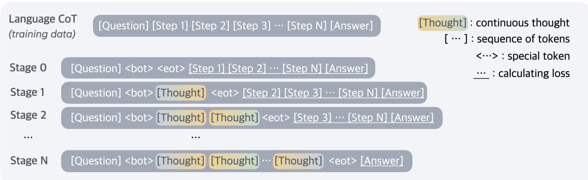
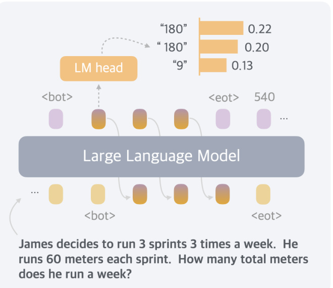
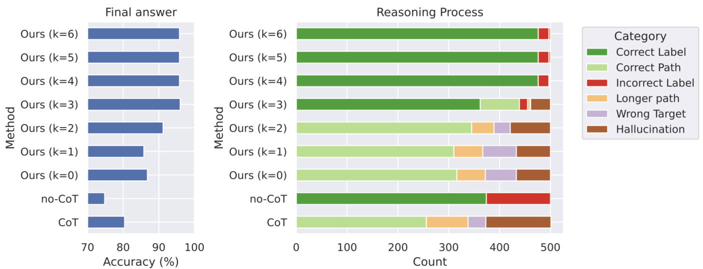
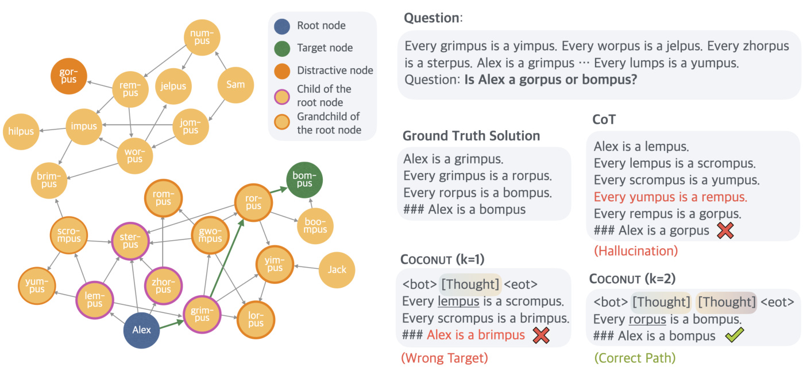
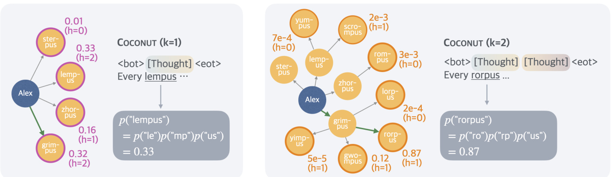
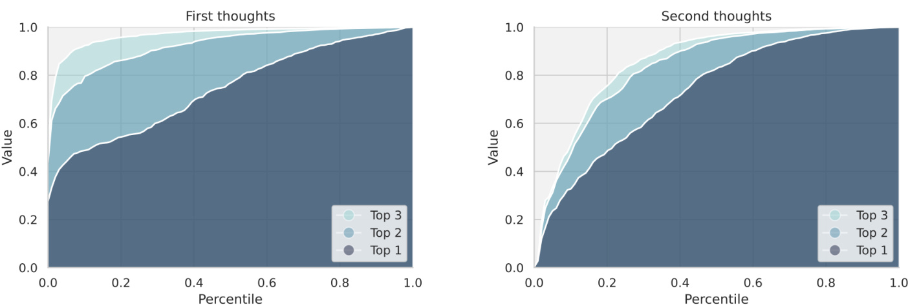
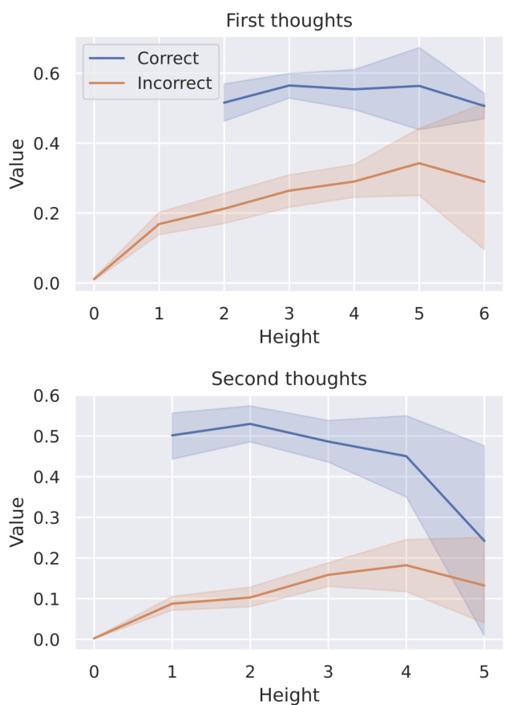

# Training Large Language Models to Reason in a Continuous Latent Space  

Shibo Hao $^{1,2,*}$ , Sainbayar Sukhbaatar1, DiJia $\mathtt{s u}^{1}$ , Xian Li1, Zhiting ${\mathsf{H}}{\mathsf{u}}^{2}$ , Jason Weston1, Yuandong Tian1   
1FAIR at Meta, $^2$ UC San Diego   
∗Work done at Meta  

Large language models (LLMs) are restricted to reason in the “language space”, where they typically express the reasoning process with a chain-of-thought (CoT) to solve a complex reasoning problem. However, we argue that language space may not always be optimal for reasoning. For example, most word tokens are primarily for textual coherence and not essential for reasoning, while some critical tokens require complex planning and pose huge challenges to LLMs. To explore the potential of LLM reasoning in an unrestricted latent space instead of using natural language, we introduce a new paradigm Coconut (Chain of Continuous Thought). We utilize the last hidden state of the LLM as a representation of the reasoning state (termed “continuous thought”). Rather than decoding this into a word token, we feed it back to the LLM as the subsequent input embedding directly in the continuous space. Experiments show that Coconut can efectively augment the LLM on several reasoning tasks. This novel latent reasoning paradigm leads to emergent advanced reasoning patterns: the continuous thought can encode multiple alternative next reasoning steps, allowing the model to perform a breadth-frst search (BFS) to solve the problem, rather than prematurely committing to a single deterministic path like CoT. Coconut outperforms CoT in certain logical reasoning tasks that require substantial backtracking during planning, with fewer thinking tokens during inference. These fndings demonstrate the promise of latent reasoning and ofer valuable insights for future research.  

Date: December 12, 2024  

$\infty$ Meta  

# 1 Introduction  

Large language models (LLMs) have demonstrated remarkable reasoning abilities, emerging from extensive pretraining on human languages (Dubey et al., 2024; Achiam et al., 2023). While next token prediction is an efective training objective, it imposes a fundamental constraint on the LLM as a reasoning machine: the explicit reasoning process of LLMs must be generated in word tokens. For example, a prevalent approach, known as chain-of-thought (CoT) reasoning (Wei et al., 2022), involves prompting or training LLMs to generate solutions step-by-step using natural language. However, this is in stark contrast to certain human cognition results. Neuroimaging studies have consistently shown that the language network – a set of brain regions responsible for language comprehension and production – remains largely inactive during various reasoning tasks (Amalric and Dehaene, 2019; Monti et al., 2012, 2007, 2009; Fedorenko et al., 2011). Further evidence indicates that human language is optimized for communication rather than reasoning (Fedorenko et al., 2024).  

A signifcant issue arises when LLMs use language for reasoning: the amount of reasoning required for each particular reasoning token varies greatly, yet current LLM architectures allocate nearly the same computing budget for predicting every token. Most tokens in a reasoning chain are generated solely for fuency, contributing little to the actual reasoning process. On the contrary, some critical tokens require complex planning and pose huge challenges to LLMs. While previous work has attempted to fx these problems by prompting LLMs to generate succinct reasoning chains (Madaan and Yazdanbakhsh, 2022), or performing additional reasoning before generating some critical tokens (Zelikman et al., 2024), these solutions remain constrained within the language space and do not solve the fundamental problems. On the contrary, it would be ideal for LLMs to have the freedom to reason without any language constraints, and then translate their fndings into language only when necessary.  

  
Figure 1 A comparison of Chain of Continuous Thought (Coconut) with Chain-of-Thought (CoT). In CoT, the model generates the reasoning process as a word token sequence (e.g., $[x_{i},x_{i+1},...,x_{i+j}]$ in the fgure). Coconut regards the last hidden state as a representation of the reasoning state (termed “continuous thought”), and directly uses it as the next input embedding. This allows the LLM to reason in an unrestricted latent space instead of a language space.  

In this work we instead explore LLM reasoning in a latent space by introducing a novel paradigm, Coconut (Chain of Continuous Thought). It involves a simple modifcation to the traditional CoT process: instead of mapping between hidden states and language tokens using the language model head and embedding layer, Coconut directly feeds the last hidden state (a continuous thought) as the input embedding for the next token (Figure 1). This modifcation frees the reasoning from being within the language space, and the system can be optimized end-to-end by gradient descent, as continuous thoughts are fully diferentiable. To enhance the training of latent reasoning, we employ a multi-stage training strategy inspired by Deng et al. (2024), which efectively utilizes language reasoning chains to guide the training process.  

Interestingly, our proposed paradigm leads to an efcient reasoning pattern. Unlike language-based reasoning, continuous thoughts in Coconut can encode multiple potential next steps simultaneously, allowing for a reasoning process akin to breadth-frst search (BFS). While the model may not initially make the correct decision, it can maintain many possible options within the continuous thoughts and progressively eliminate incorrect paths through reasoning, guided by some implicit value functions. This advanced reasoning mechanism surpasses traditional CoT, even though the model is not explicitly trained or instructed to operate in this manner, as seen in previous works (Yao et al., 2023; Hao et al., 2023).  

Experimentally, Coconut successfully enhances the reasoning capabilities of LLMs. For math reasoning (GSM8k, Cobbe et al., 2021), using continuous thoughts is shown to be benefcial to reasoning accuracy, mirroring the efects of language reasoning chains. This indicates the potential to scale and solve increasingly challenging problems by chaining more continuous thoughts. On logical reasoning including ProntoQA (Saparov and He, 2022), and our newly proposed ProsQA (Section 4.1) which requires stronger planning ability, Coconut and some of its variants even surpasses language-based CoT methods, while generating signifcantly fewer tokens during inference. We believe that these fndings underscore the potential of latent reasoning and could provide valuable insights for future research.  

# 2 Related Work  

Chain-of-thought (CoT) reasoning. We use the term chain-of-thought broadly to refer to methods that generate an intermediate reasoning process in language before outputting the fnal answer. This includes prompting LLMs (Wei et al., 2022; Khot et al., 2022; Zhou et al., 2022), or training LLMs to generate reasoning chains, either with supervised fnetuning (Yue et al., 2023; Yu et al., 2023) or reinforcement learning (Wang et al., 2024; Havrilla et al., 2024; Shao et al., 2024; Yu et al., 2024a). Madaan and Yazdanbakhsh (2022) classifed the tokens in CoT into symbols, patterns, and text, and proposed to guide the LLM to generate concise CoT based on analysis of their roles. Recent theoretical analyses have demonstrated the usefulness of CoT from the perspective of model expressivity (Feng et al., 2023; Merrill and Sabharwal, 2023; Li et al., 2024). By employing CoT, the efective depth of the transformer increases because the generated outputs are looped back to the input (Feng et al., 2023). These analyses, combined with the established efectiveness of CoT, motivated our design that feeds the continuous thoughts back to the LLM as the next input embedding. While CoT has proven efective for certain tasks, its autoregressive generation nature makes it challenging to mimic human reasoning on more complex problems (LeCun, 2022; Hao et al., 2023), which typically require planning and search. There are works that equip LLMs with explicit tree search algorithms (Xie et al., 2023; Yao et al., 2023; Hao et al., 2024), or train the LLM on search dynamics and trajectories (Lehnert et al., 2024; Gandhi et al., 2024; Su et al., 2024). In our analysis, we fnd that after removing the constraint of a language space, a new reasoning pattern similar to BFS emerges, even though the model is not explicitly trained in this way.  

Latent reasoning in LLMs. Previous works mostly defne latent reasoning in LLMs as the hidden computation in transformers (Yang et al., 2024; Biran et al., 2024). Yang et al. (2024) constructed a dataset of two-hop reasoning problems and discovered that it is possible to recover the intermediate variable from the hidden representations. Biran et al. (2024) further proposed to intervene the latent reasoning by “back-patching” the hidden representation. Shalev et al. (2024) discovered parallel latent reasoning paths in LLMs. Another line of work has discovered that, even if the model generates a CoT to reason, the model may actually utilize a diferent latent reasoning process. This phenomenon is known as the unfaithfulness of CoT reasoning (Wang et al., 2022; Turpin et al., 2024). To enhance the latent reasoning of LLM, previous research proposed to augment it with additional tokens. Goyal et al. (2023) pretrained the model by randomly inserting a learnable <pause> tokens to the training corpus. This improves LLM’s performance on a variety of tasks, especially when followed by supervised fnetuning with <pause> tokens. On the other hand, Pfau et al. (2024) further explored the usage of fller tokens, e.g., “...”, and concluded that they work well for highly parallelizable problems. However, Pfau et al. (2024) mentioned these methods do not extend the expressivity of the LLM like CoT; hence, they may not scale to more general and complex reasoning problems. Wang et al. (2023) proposed to predict a planning token as a discrete latent variable before generating the next reasoning step. Recently, it has also been found that one can “internalize” the CoT reasoning into latent reasoning in the transformer with knowledge distillation (Deng et al., 2023) or a special training curriculum which gradually shortens CoT (Deng et al., 2024). Yu et al. (2024b) also proposed to distill a model that can reason latently from data generated with complex reasoning algorithms. These training methods can be combined to our framework, and specifcally, we fnd that breaking down the learning of continuous thoughts into multiple stages, inspired by iCoT (Deng et al., 2024), is very benefcial for the training. Recently, looped transformers (Giannou et al., 2023; Fan et al., 2024) have been proposed to solve algorithmic tasks, which have some similarities to the computing process of continuous thoughts, but we focus on common reasoning tasks and aim at investigating latent reasoning in comparison to language space.  

# 3 Coconut: Chain of Continuous Thought  

In this section, we introduce our new paradigm Coconut (Chain of Continuous Thought) for reasoning in an unconstrained latent space. We begin by introducing the background and notation we use for language models. For an input sequence $\boldsymbol{x}=(x_{1},...,x_{T})$ , the standard large language model $\mathcal{M}$ can be described as:  

```latext formula_1
$$
\begin{array}{c}{H_{t}=\operatorname{Transformer}(E_{t})}\\ {\mathcal{M}(x_{t+1}\mid x_{\le t})=\operatorname{softmax}(W h_{t})}\end{array}
$$  
```

where $E_{t}=[e(x_{1}),e(x_{2}),...,e(x_{t})]$ is the sequence of token embeddings up to position $t$ ; $H_{t}\in\mathbb{R}^{t\times d}$ is the matrix of the last hidden states for all tokens up to position $t$ ; $h_{t}$ is the last hidden state of position $t$ , i.e., $h_{t}=H_{t}[t,:];\,e(\cdot)$ is the token embedding function; $W$ is the parameter of the language model head.  

Method Overview. In the proposed Coconut method, the LLM switches between the “language mode” and “latent mode” (Figure 1). In language mode, the model operates as a standard language model, autoregressively generating the next token. In latent mode, it directly utilizes the last hidden state as the next input embedding. This last hidden state represents the current reasoning state, termed as a “continuous thought”.  

Special tokens <bot> and <eot> are employed to mark the beginning and end of the latent thought mode, respectively. As an example, we assume latent reasoning occurs between positions $i$ and $j$ , i.e., $x_{i}=$ $<b\cot>$ and $x_{j}=<\tt e o t>$ . When the model is in the latent mode $(i<t<j$ ), we use the last hidden state from the previous token to replace the input embedding, i.e., $E_{t}=[e(x_{1}),e(x_{2}),...,e(x_{i}),h_{i},h_{i+1},...,h_{t-1}]$  

  
Figure 2 Training procedure of Chain of Continuous Thought (Coconut). Given training data with language reasoning steps, at each training stage we integrate $c$ additional continuous thoughts ( $c=1$ in this example), and remove one language reasoning step. The cross-entropy loss is then used on the remaining tokens after continuous thoughts.  

After the latent mode fnishes $(t\ \geq\ j)$ , the input reverts to using the token embedding, i.e., $E_{t}~=$ $[e(x_{1}),e(x_{2}),...,e(x_{i}),h_{i},h_{i+1},...,h_{j-1},e(x_{j}),...,e(x_{t})]$ . It is worth noting that the last hidden states have been processed by the fnal normalization layer, so they are not too large in magnitude. $\mathcal{M}(x_{t+1}\mid x_{\leq t})$ is not defned when $i<t<j$ , since the latent thought is not intended to be mapped back to language space. However, softmax $\left(W h_{t}\right)$ can still be calculated for probing purposes (see Section 4).  

Training Procedure. In this work, we focus on a problem-solving setting where the model receives a question as input and is expected to generate an answer through a reasoning process. We leverage language CoT data to supervise continuous thought by implementing a multi-stage training curriculum inspired by Deng et al. (2024). As shown in Figure 2, in the initial stage, the model is trained on regular CoT instances. In the subsequent stages, at the $k$ -th stage, the frst $k$ reasoning steps in the CoT are replaced with $k\times c$ continuous thoughts1, where $c$ is a hyperparameter controlling the number of latent thoughts replacing a single language reasoning step. Following Deng et al. (2024), we also reset the optimizer state when training stages switch. We insert <bot> and <eot> tokens (which are not counted towards $c$ ) to encapsulate the continuous thoughts.  

During the training process, we optimize the normal negative log-likelihood loss, but mask the loss on questions and latent thoughts. It is important to note that the objective does not encourage the continuous thought to compress the removed language thought, but rather to facilitate the prediction of future reasoning. Therefore, it’s possible for the LLM to learn more efective representations of reasoning steps compared to human language.  

Training Details. Our proposed continuous thoughts are fully diferentiable and allow for back-propagation. We perform $n+1$ forward passes when $n$ latent thoughts are scheduled in the current training stage, computing a new latent thought with each pass and fnally conducting an additional forward pass to obtain a loss on the remaining text sequence. While we can save any repetitive computing by using a KV cache, the sequential nature of the multiple forward passes poses challenges for parallelism. Further optimizing the training efciency of Coconut remains an important direction for future research.  

Inference Process. The inference process for Coconut is analogous to standard language model decoding, except that in latent mode, we directly feed the last hidden state as the next input embedding. A challenge lies in determining when to switch between latent and language modes. As we focus on the problem-solving setting, we insert a <bot> token immediately following the question tokens. For <eot>, we consider two potential strategies: a) train a binary classifer on latent thoughts to enable the model to autonomously decide when to terminate the latent reasoning, or b) always pad the latent thoughts to a constant length. We found that both approaches work comparably well. Therefore, we use the second option in our experiment for simplicity, unless specifed otherwise.  

# 4 Experiments  

We validate the feasibility of LLM reasoning in a continuous latent space through experiments on three datasets. We mainly evaluate the accuracy by comparing the model-generated answers with the ground truth. The number of newly generated tokens per question is also analyzed, as a measure of reasoning efciency. We report the clock-time comparison in Appendix B.  

# 4.1 Reasoning Tasks  

Math Reasoning. We use GSM8k (Cobbe et al., 2021) as the dataset for math reasoning. It consists of grade school-level math problems. Compared to the other datasets in our experiments, the problems are more diverse and open-domain, closely resembling real-world use cases. Through this task, we explore the potential of latent reasoning in practical applications. To train the model, we use a synthetic dataset generated by Deng et al. (2023).  

Logical Reasoning. Logical reasoning involves the proper application of known conditions to prove or disprove a conclusion using logical rules. This requires the model to choose from multiple possible reasoning paths, where the correct decision often relies on exploration and planning ahead. We use 5-hop ProntoQA (Saparov and He, 2022) questions, with fctional concept names. For each problem, a tree-structured ontology is randomly generated and described in natural language as a set of known conditions. The model is asked to judge whether a given statement is correct based on these conditions. This serves as a simplifed simulation of more advanced reasoning tasks, such as automated theorem proving (Chen et al., 2023; DeepMind, 2024).  

We found that the generation process of ProntoQA could be more challenging, especially since the size of distracting branches in the ontology is always small, reducing the need for complex planning. To fx that, we apply a new dataset construction pipeline using randomly generated DAGs to structure the known conditions. The resulting dataset requires the model to perform substantial planning and searching over the graph to fnd the correct reasoning chain. We refer to this new dataset as ProsQA (Proof with Search Question-Answering). A visualized example is shown in Figure 6. More details of datasets can be found in Appendix A.  

# 4.2 Experimental Setup  

We use a pre-trained GPT-2 (Radford et al., 2019) as the base model for all experiments. The learning rate is set to $1\times10^{-4}$ while the efective batch size is 128. Following Deng et al. (2024), we also reset the optimizer when the training stages switch.  

Math Reasoning. By default, we use 2 latent thoughts (i.e., $c=2$ ) for each reasoning step. We analyze the correlation between performance and $c$ in Section 4.4. The model goes through 3 stages besides the initial stage. Then, we have an additional stage, where we still use $3\times c$ continuous thoughts as in the penultimate stage, but remove all the remaining language reasoning chain. This handles the long-tail distribution of reasoning chains longer than 3 steps. We train the model for 6 epochs in the initial stage, and 3 epochs in each remaining stage.  

Logical Reasoning. We use one continuous thought for every reasoning step (i.e., $c=1$ ). The model goes through 6 training stages in addition to the initial stage, because the maximum number of reasoning steps is 6 in these two datasets. The model then fully reasons with continuous thoughts to solve the problems in the last stage. We train the model for 5 epochs per stage.  

For all datasets, after the standard schedule, the model stays in the fnal training stage, until the 50th epoch. We select the checkpoint based on the accuracy on the validation set. For inference, we manually set the number of continuous thoughts to be consistent with their fnal training stage. We use greedy decoding for all experiments.  

# 4.3 Baselines and Variants of Coconut  

We consider the following baselines: (1) CoT : We use the complete reasoning chains to train the language model with supervised fnetuning, and during inference, the model generates a reasoning chain before outputting an answer. (2) No-CoT : The LLM is trained to directly generate the answer without using a reasoning chain. (3) $i C o T$ (Deng et al., 2024): The model is trained with language reasoning chains and follows a carefully designed schedule that “internalizes” CoT. As the training goes on, tokens at the beginning of the reasoning chain are gradually removed until only the answer remains. During inference, the model directly predicts the answer. (4) Pause token (Goyal et al., 2023): The model is trained using only the question and answer, without a reasoning chain. However, diferent from No-CoT, special <pause> tokens are inserted between the question and answer, which are believed to provide the model with additional computational capacity to derive the answer. For a fair comparison, the number of <pause> tokens is set the same as continuous thoughts in Coconut.  

Table 1 Results on three datasets: GSM8l, ProntoQA and ProsQA. Higher accuracy indicates stronger reasoning ability, while generating fewer tokens indicates better efciency. ∗The result is from Deng et al. (2024).   


<html><body><table><tr><td rowspan="2">Method</td><td colspan="2">GSM8k</td><td colspan="2">ProntoQA</td><td colspan="2">ProsQA</td></tr><tr><td>Acc. . (%)</td><td># Tokens</td><td>Acc. (%)</td><td># Tokens</td><td>Acc. (%)</td><td># Tokens</td></tr><tr><td>CoT</td><td>42.9 ±0.2</td><td>25.0</td><td>98.8 ±0.8</td><td>92.5</td><td>77.5 ±1.9</td><td>49.4</td></tr><tr><td>No-CoT</td><td>16.5 ±0.5</td><td>2.2</td><td>93.8 ±0.7</td><td>3.0</td><td>76.7 ±1.0</td><td>8.2</td></tr><tr><td>iCoT</td><td>30.0*</td><td>2.2</td><td>99.8 ±0.3</td><td>3.0</td><td>98.2 ±0.3</td><td>8.2</td></tr><tr><td>Pause Token</td><td>16.4 ±1.8</td><td>2.2</td><td>77.7: ±21.0</td><td>3.0</td><td>75.9 ±0.7</td><td>8.2</td></tr><tr><td>COCONUT (Ours)</td><td>34.1 ±1.5</td><td>8.2</td><td>99.8 ±0.2</td><td>9.0</td><td>97.0 ±0.3</td><td>14.2</td></tr><tr><td>- w/o curriculum</td><td>14.4 ±0.8</td><td>8.2</td><td>52.4 ±0.4</td><td>9.0</td><td>76.1 ±0.2</td><td>14.2</td></tr><tr><td>- w/o thought</td><td>21.6 ±0.5</td><td>2.3</td><td>99.9 ±0.1</td><td>3.0</td><td>95.5 ±1.1</td><td>8.2</td></tr><tr><td>- pause as thought</td><td>24.1 ±0.7</td><td>2.2</td><td>100.0 ±0.1</td><td>3.0</td><td>96.6 ±0.8</td><td>8.2</td></tr></table></body></html>  

We also evaluate some variants of our method: (1) w/o curriculum: Instead of the multi-stage training, we directly use the data from the last stage which only includes questions and answers to train Coconut. The model uses continuous thoughts to solve the whole problem. (2) w/o thought: We keep the multi-stage training which removes language reasoning steps gradually, but don’t use any continuous latent thoughts. While this is similar to $i C o\,T$ in the high-level idea, the exact training schedule is set to be consistent with Coconut, instead of $i C o T$ . This ensures a more strict comparison. (3) Pause as thought: We use special <pause> tokens to replace the continuous thoughts, and apply the same multi-stage training curriculum as Coconut.  

# 4.4 Results and Discussion  

We show the overall results on all datasets in Table 1. Continuous thoughts efectively enhance LLM reasoning, as shown by the consistent improvement over $n o{-}C o T$ . It even shows better performance than $\mathit{C o T}$ on ProntoQA and ProsQA. We describe several key conclusions from the experiments as follows.  

“Chaining” continuous thoughts enhances reasoning. In conventional CoT, the output token serves as the next input, which proves to increase the efective depth of LLMs and enhance their expressiveness (Feng et al., 2023). We explore whether latent space reasoning retains this property, as it would suggest that this method could scale to solve increasingly complex problems by chaining multiple latent thoughts.  

In our experiments with GSM8k, we found that Coconut outperformed other architectures trained with similar strategies, particularly surpassing the latest baseline, $i C o T$ (Deng et al., 2024). The performance is signifcantly better than Coconut (pause as thought) which also enables more computation in the LLMs. While Pfau et al. (2024) empirically shows that fller tokens, such as the special <pause> tokens, can beneft highly parallelizable problems, our results show that Coconut architecture is more efective for general problems, e.g., math word problems, where a reasoning step often heavily depends on previous steps. Additionally, we experimented with adjusting the hyperparameter $c$ , which controls the number of latent thoughts corresponding to one language reasoning step (Figure 3). As we increased $c$ from 0 to $^{1}$ to 2, the model’s performance steadily improved.2 These results suggest that a chaining efect similar to CoT can be observed in the latent space.  

  
Figure 3 Accuracy on GSM8k with diferent number of continuous thoughts.  

In two other synthetic tasks, we found that the variants of Coconut (w/o thoughts or pause as thought), and the $i C o T$ baseline also achieve impressive accuracy. This indicates that the model’s computational capacity may not be the bottleneck in these tasks. In contrast, GSM8k, being an open-domain question-answering task, likely involves more complex contextual understanding and modeling, placing higher demands on computational capability.  

Latent reasoning outperforms language reasoning in planning-intensive tasks. Complex reasoning often requires the model to “look ahead” and evaluate the appropriateness of each step. Among our datasets, GSM8k and ProntoQA are relatively straightforward for next-step prediction, due to intuitive problem structures and limited branching. In contrast, ProsQA’s randomly generated DAG structure signifcantly challenges the model’s planning capabilities. As shown in Table 1, $C o T$ does not ofer notable improvement over No-CoT. However, Coconut, its variants, and $i C o T$ substantially enhance reasoning on ProsQA, indicating that latent space reasoning provides a clear advantage in tasks demanding extensive planning. An in-depth analysis of this process is provided in Section 5.  

The LLM still needs guidance to learn latent reasoning. In the ideal case, the model should learn the most efective continuous thoughts automatically through gradient descent on questions and answers (i.e., Coconut $w/o$ curriculum). However, from the experimental results, we found the models trained this way do not perform any better than no-CoT.  

With the multi-stage curriculum which decomposes the training into easier objectives, Coconut is able to achieve top performance across various tasks. The multi-stage training also integrates well with pause tokens (Coconut- pause as thought). Despite using the same architecture and similar multi-stage training objectives, we observed a small gap between the performance of $i C o T$ and Coconut (w/o thoughts). The fner-grained removal schedule (token by token) and a few other tricks in $i C o T$ may ease the training process. We leave combining $i C o T$ and Coconut as future work. While the multi-stage training used for Coconut has proven efective, further research is defnitely needed to develop better and more general strategies for learning reasoning in latent space, especially without the supervision from language reasoning chains.  

  
Figure 4 A case study where we decode the continuous thought into language tokens.  

Continuous thoughts are efficient representations of reasoning. Though the continuous thoughts are not intended to be decoded to language tokens, we can  

still use it as an intuitive interpretation of the continuous thought. We show a case study in Figure 4 of a math word problem solved by Coconut $\mathit{\Pi}_{c}=1\;\;$ ). The frst continuous thought can be decoded into tokens like “ $\mathrm{\Omega}180^{\circ}$ , “ $180^{\circ}$ (with a space), and “9”. Note that, the reasoning trace for this problem should be $3\times3\times60=9\times60=540$ , or $3\times3\times60=3\times180=540$ . The interpretations of the frst thought happen to be the frst intermediate variables in the calculation. Moreover, it encodes a distribution of diferent traces into the continuous thoughts. As shown in Section 5.3, this feature enables a more advanced reasoning pattern for planning-intense reasoning tasks.  

  
Figure 5 The accuracy of fnal answer (left) and reasoning process (right) of multiple variants of Coconut and baselines on ProsQA.  

# 5 Understanding the Latent Reasoning in Coconut  

In this section, we present an analysis of the latent reasoning process with a variant of Coconut. By leveraging its ability to switch between language and latent space reasoning, we are able to control the model to interpolate between fully latent reasoning and fully language reasoning and test their performance (Section 5.2). This also enables us to interpret the the latent reasoning process as tree search (Section 5.3). Based on this perspective, we explain why latent reasoning can make the decision easier for LLMs (Section 5.4).  

# 5.1 Experimental Setup  

Methods. The design of Coconut allows us to control the number of latent thoughts by manually setting the position of the $<\tt e o t>$ token during inference. When we enforce Coconut to use $k$ continuous thoughts, the model is expected to output the remaining reasoning chain in language, starting from the $k+1$ step. In our experiments, we test variants of Coconut on ProsQA with $k\in\{0,1,2,3,4,5,6\}$ . Note that all these variants only difer in inference time while sharing the same model weights. Besides, we report the performance of $\mathit{C o T}$ and no-CoT as references.  

To address the issue of forgetting earlier training stages, we modify the original multi-stage training curriculum by always mixing data from other stages with a certain probability $p=0.3$ ). This updated training curriculum yields similar performance and enables efective control over the switch between latent and language reasoning.  

Metrics. We apply two sets of evaluation metrics. One of them is based on the correctness of the fnal answer, regardless of the reasoning process. It is the metric used in the main experimental results above (Section 4.4). To enable fne-grained analysis, we defne another metric on the reasoning process. Assuming we have a complete language reasoning chain which specifes a path in the graph, we can classify it into (1) Correct Path: The output is one of the shortest paths to the correct answer. (2) Longer Path: A valid path that correctly answers the question but is longer than the shortest path. (3) Hallucination: The path includes nonexistent edges or is disconnected. (4) Wrong Target: A valid path in the graph, but the destination node is not the one being asked. These four categories naturally apply to the output from Coconut ( $k=0$ ) and $C o T$ , which generate the full path. For Coconut with $k>0$ that outputs only partial paths in language (with the initial steps in continuous reasoning), we classify the reasoning as a Correct Path if a valid explanation can complete it. Also, we defne Longer Path and Wrong Target for partial paths similarly. If no valid explanation completes the path, it’s classifed as hallucination. In no-CoT and Coconut with larger $k$ , the model may only output the fnal answer without any partial path, and it falls into (5) Correct Label or (6) Incorrect Label. These six categories cover all cases without overlap.  

  
Figure 6 A case study of ProsQA. The model trained with $C o T$ hallucinates an edge (Every yumpus is a rempus) after getting stuck in a dead end. Coconut $\mathrm{k=1}$ ) outputs a path that ends with an irrelevant node. Coconut $\scriptstyle\mathrm{k=2}$ ) solves the problem correctly.  

  
Figure 7 An illustration of the latent search trees. The example is the same test case as in Figure 6. The height of a node (denoted as $h$ in the fgure) is defned as the longest distance to any leaf nodes in the graph. We show the probability of the frst concept predicted by the model following latent thoughts (e.g., “lempus” in the left fgure). It is calculated as the multiplication of the probability of all tokens within the concept conditioned on previous context (omitted in the fgure for brevity). This metric can be interpreted as an implicit value function estimated by the model, assessing the potential of each node leading to the correct answer.  

# 5.2 Interpolating between Latent and Language Reasoning  

Figure 5 shows a comparative analysis of diferent reasoning methods on ProsQA. As more reasoning is done with continuous thoughts (increasing $k$ ), both fnal answer accuracy (Figure 5, left) and the rate of correct reasoning processes (“Correct Label” and “Correct Path” in Figure 5, right) improve. Additionally, the rate of “Hallucination” and “Wrong Target” decrease, which typically occur when the model makes a wrong move earlier. This also indicates the better planning ability when more reasoning happens in the latent space.  

A case study is shown in Figure 6, where $\mathit{C o T}$ hallucinates an nonexistent edge, Coconut ( $k=1$ ) leads to a wrong target, but Coconut ( $k=2$ ) successfully solves the problem. In this example, the model cannot accurately determine which edge to choose at the earlier step. However, as latent reasoning can avoid making a hard choice upfront, the model can progressively eliminate incorrect options in subsequent steps and achieves higher accuracy at the end of reasoning. We show more evidence and details of this reasoning process in Section 5.3.  

The comparison between $\mathit{C o T}$ and Coconut ( $k=0$ ) reveals another interesting observation: even when  

  
Figure 8 Analysis of parallelism in latent tree search. The left plot depicts the cumulative value of the top-1, top-2, and top-3 candidate nodes for the frst thoughts, calculated across test cases and ranked by percentile. The signifcant gaps between the lines refect the model’s ability to explore alternative latent thoughts in parallel. The right plot shows the corresponding analysis for the second thoughts, where the gaps between lines are narrower, indicating reduced parallelism and increased certainty in reasoning as the search tree develops. This shift highlights the model’s transition toward more focused exploration in later stages.  

Coconut is forced to generate a complete reasoning chain, the accuracy of the answers is still higher than $\mathit{C o T}$ . The generated reasoning paths are also more accurate with less hallucination. From this, we can infer that the training method of mixing diferent stages improves the model’s ability to plan ahead. The training objective of $\mathit{C o T}$ always concentrates on the generation of the immediate next step, making the model “shortsighted”. In later stages of Coconut training, the frst few steps are hidden, allowing the model to focus more on future steps. This is related to the fndings of Gloeckle et al. (2024), where they propose multi-token prediction as a new pretraining objective to improve the LLM’s ability to plan ahead.  

# 5.3 Interpreting the Latent Search Tree  

Given the intuition that continuous thoughts can encode multiple potential next steps, the latent reasoning can be interpreted as a search tree, rather than merely a reasoning “chain”. Taking the case of Figure 6 as a concrete example, the frst step could be selecting one of the children of Alex, i.e., {lempus, sterpus, zhorpus, grimpus}. We depict all possible branches in the left part of Figure 7. Similarly, in the second step, the frontier nodes will be the grandchildren of Alex (Figure 7, right).  

Unlike a standard breadth-frst search (BFS), which explores all frontier nodes uniformly, the model demonstrates the ability to prioritize promising nodes while pruning less relevant ones. To uncover the model’s preferences, we analyze its subsequent outputs in language space. For instance, if the model is forced to switch back to language space after a single latent thought ( $k=1$ ), it predicts the next step in a structured format, such as “every [Concept A] is a [Concept B].” By examining the probability distribution over potential fllers for [Concept A], we can derive numeric values for the children of the root node Alex (Figure 7, left). Similarly, when $k=2$ , the prediction probabilities for all frontier nodes—the grandchildren of Alex —are obtained (Figure 7, right).  

The probability distribution can be viewed as the model’s implicit value function, estimating each node’s potential to reach the target. As shown in the fgure, “lempus”, “zhorpus”, “grimpus”, and “sterpus” have a value of 0.33, 0.16, 0.32, and 0.01, respectively. This indicates that in the frst continuous thought, the model has mostly ruled out “sterpus” as an option but remains uncertain about the correct choice among the other three. In the second thought, however, the model has mostly ruled out other options but focused on “rorpus”.  

Figure 8 presents an analysis of the parallelism in the model’s latent reasoning across the frst and second thoughts. For the frst thoughts (left panel), the cumulative values of the top-1, top-2, and top-3 candidate nodes are computed and plotted against their respective percentiles across the test set. The noticeable gaps between the three lines indicate that the model maintains signifcant diversity in its reasoning paths at this stage, suggesting a broad exploration of alternative possibilities. In contrast, the second thoughts (right panel) show a narrowing of these gaps. This trend suggests that the model transitions from parallel exploration to more focused reasoning in the second latent reasoning step, likely as it gains more certainty about the most promising paths.  

# 5.4 Why is a Latent Space Better for Planning?  

In this section, we explore why latent reasoning is advantageous for planning, drawing on the search tree perspective and the value function defned earlier. Referring to our illustrative example, a key distinction between “sterpus” and the other three options lies in the structure of the search tree: “sterpus” is a leaf node (Figure 6). This makes it immediately identifable as an incorrect choice, as it cannot lead to the target node “bompus”. In contrast, the other nodes have more descendants to explore, making their evaluation more challenging.  

To quantify a node’s exploratory potential, we measure its height in the tree, defned as the shortest distance to any leaf node. Based on this notion, we hypothesize that nodes with lower heights are easier to evaluate accurately, as their exploratory potential is limited. Consistent with this hypothesis, in our example, the model exhibits greater uncertainty between “grimpus” and “lempus”, both of which have a height of 2—higher than the other candidates.  

To test this hypothesis more rigorously, we analyze the correlation between the model’s prediction probabilities and node heights during the frst and second latent reasoning steps across the test set. Figure 9 reveals a clear pattern: the model successfully assigns lower values to incorrect nodes and higher values to correct nodes when their heights are low. However, as node heights increase, this distinction becomes less pronounced, indicating greater difculty in accurate evaluation.  

  
Figure 9 The correlation between prediction probability of concepts and their heights.  

In conclusion, these fndings highlight the benefts of leveraging latent space for planning. By delaying defnite decisions and expanding the latent reasoning process, the model pushes its exploration closer to the search tree’s terminal states, making it easier to distinguish correct nodes from incorrect ones.  

# 6 Conclusion  

In this paper, we presented Coconut, a novel paradigm for reasoning in continuous latent space. Through extensive experiments, we demonstrated that Coconut signifcantly enhances LLM reasoning capabilities. Notably, our detailed analysis highlighted how an unconstrained latent space allows the model to develop an efective reasoning pattern similar to BFS. Future work is needed to further refne and scale latent reasoning methods. One promising direction is pretraining LLMs with continuous thoughts, which may enable models to generalize more efectively across a wider range of reasoning scenarios. We anticipate that our fndings will inspire further research into latent reasoning methods, ultimately contributing to the development of more advanced machine reasoning systems.  

# Acknowledgement  

The authors express their sincere gratitude to Jihoon Tack for his valuable discussions throughout the course of this work.  

# References  

Josh Achiam, Steven Adler, Sandhini Agarwal, Lama Ahmad, Ilge Akkaya, Florencia Leoni Aleman, Diogo Almeida, Janko Altenschmidt, Sam Altman, Shyamal Anadkat, et al. Gpt-4 technical report. arXiv preprint arXiv:2303.08774, 2023.   
Marie Amalric and Stanislas Dehaene. A distinct cortical network for mathematical knowledge in the human brain. NeuroImage, 189:19–31, 2019.   
Eden Biran, Daniela Gottesman, Sohee Yang, Mor Geva, and Amir Globerson. Hopping too late: Exploring the limitations of large language models on multi-hop queries. arXiv preprint arXiv:2406.12775, 2024.   
Wenhu Chen, Ming Yin, Max Ku, Pan Lu, Yixin Wan, Xueguang Ma, Jianyu Xu, Xinyi Wang, and Tony Xia. Theoremqa: A theorem-driven question answering dataset. In Proceedings of the 2023 Conference on Empirical Methods in Natural Language Processing, pages 7889–7901, 2023.   
Karl Cobbe, Vineet Kosaraju, Mohammad Bavarian, Mark Chen, Heewoo Jun, Lukasz Kaiser, Matthias Plappert, Jerry Tworek, Jacob Hilton, Reiichiro Nakano, et al. Training verifers to solve math word problems. arXiv preprint arXiv:2110.14168, 2021.   
Google DeepMind. Ai achieves silver-medal standard solving international mathematical olympiad problems, 2024. https://deepmind.google/discover/blog/ai-solves-imo-problems-at-silver-medal-level/.   
Yuntian Deng, Kiran Prasad, Roland Fernandez, Paul Smolensky, Vishrav Chaudhary, and Stuart Shieber. Implicit chain of thought reasoning via knowledge distillation. arXiv preprint arXiv:2311.01460, 2023.   
Yuntian Deng, Yejin Choi, and Stuart Shieber. From explicit cot to implicit cot: Learning to internalize cot step by step. arXiv preprint arXiv:2405.14838, 2024.   
Abhimanyu Dubey, Abhinav Jauhri, Abhinav Pandey, Abhishek Kadian, Ahmad Al-Dahle, Aiesha Letman, Akhil Mathur, Alan Schelten, Amy Yang, Angela Fan, et al. The llama 3 herd of models. arXiv preprint arXiv:2407.21783, 2024.   
Ying Fan, Yilun Du, Kannan Ramchandran, and Kangwook Lee. Looped transformers for length generalization. arXiv preprint arXiv:2409.15647, 2024.   
Evelina Fedorenko, Michael K Behr, and Nancy Kanwisher. Functional specifcity for high-level linguistic processing in the human brain. Proceedings of the National Academy of Sciences, 108(39):16428–16433, 2011.   
Evelina Fedorenko, Steven T Piantadosi, and Edward AF Gibson. Language is primarily a tool for communication rather than thought. Nature, 630(8017):575–586, 2024.   
Guhao Feng, Bohang Zhang, Yuntian Gu, Haotian Ye, Di He, and Liwei Wang. Towards revealing the mystery behind chain of thought: a theoretical perspective. Advances in Neural Information Processing Systems, 36, 2023.   
Kanishk Gandhi, Denise Lee, Gabriel Grand, Muxin Liu, Winson Cheng, Archit Sharma, and Noah D Goodman. Stream of search (sos): Learning to search in language. arXiv preprint arXiv:2404.03683, 2024.   
Angeliki Giannou, Shashank Rajput, Jy-yong Sohn, Kangwook Lee, Jason D Lee, and Dimitris Papailiopoulos. Looped transformers as programmable computers. In International Conference on Machine Learning, pages 11398–11442. PMLR, 2023.   
Fabian Gloeckle, Badr Youbi Idrissi, Baptiste Rozière, David Lopez-Paz, and Gabriel Synnaeve. Better & faster large language models via multi-token prediction. arXiv preprint arXiv:2404.19737, 2024.   
Sachin Goyal, Ziwei Ji, Ankit Singh Rawat, Aditya Krishna Menon, Sanjiv Kumar, and Vaishnavh Nagarajan. Think before you speak: Training language models with pause tokens. arXiv preprint arXiv:2310.02226, 2023.   
Shibo Hao, Yi Gu, Haodi Ma, Joshua Jiahua Hong, Zhen Wang, Daisy Zhe Wang, and Zhiting Hu. Reasoning with language model is planning with world model. arXiv preprint arXiv:2305.14992, 2023.   
Shibo Hao, Yi Gu, Haotian Luo, Tianyang Liu, Xiyan Shao, Xinyuan Wang, Shuhua Xie, Haodi Ma, Adithya Samavedhi, Qiyue Gao, et al. Llm reasoners: New evaluation, library, and analysis of step-by-step reasoning with large language models. arXiv preprint arXiv:2404.05221, 2024.   
Alex Havrilla, Yuqing Du, Sharath Chandra Raparthy, Christoforos Nalmpantis, Jane Dwivedi-Yu, Maksym Zhuravinskyi, Eric Hambro, Sainbayar Sukhbaatar, and Roberta Raileanu. Teaching large language models to reason with reinforcement learning. arXiv preprint arXiv:2403.04642, 2024.   
Tushar Khot, Harsh Trivedi, Matthew Finlayson, Yao Fu, Kyle Richardson, Peter Clark, and Ashish Sabharwal. Decomposed prompting: A modular approach for solving complex tasks. arXiv preprint arXiv:2210.02406, 2022.   
Yann LeCun. A path towards autonomous machine intelligence version 0.9. 2, 2022-06-27. Open Review, 62(1):1–62, 2022.   
Lucas Lehnert, Sainbayar Sukhbaatar, Paul Mcvay, Michael Rabbat, and Yuandong Tian. Beyond a\*: Better planning with transformers via search dynamics bootstrapping. arXiv preprint arXiv:2402.14083, 2024.   
Zhiyuan Li, Hong Liu, Denny Zhou, and Tengyu Ma. Chain of thought empowers transformers to solve inherently serial problems. arXiv preprint arXiv:2402.12875, 2024.   
Aman Madaan and Amir Yazdanbakhsh. Text and patterns: For efective chain of thought, it takes two to tango. arXiv preprint arXiv:2209.07686, 2022.   
William Merrill and Ashish Sabharwal. The expresssive power of transformers with chain of thought. arXiv preprint arXiv:2310.07923, 2023.   
Martin M Monti, Daniel N Osherson, Michael J Martinez, and Lawrence M Parsons. Functional neuroanatomy of deductive inference: a language-independent distributed network. Neuroimage, 37(3):1005–1016, 2007.   
Martin M Monti, Lawrence M Parsons, and Daniel N Osherson. The boundaries of language and thought in deductive inference. Proceedings of the National Academy of Sciences, 106(30):12554–12559, 2009.   
Martin M Monti, Lawrence M Parsons, and Daniel N Osherson. Thought beyond language: neural dissociation of algebra and natural language. Psychological science, 23(8):914–922, 2012.   
Jacob Pfau, William Merrill, and Samuel R Bowman. Let’s think dot by dot: Hidden computation in transformer language models. arXiv preprint arXiv:2404.15758, 2024.   
Alec Radford, Jefrey Wu, Rewon Child, David Luan, Dario Amodei, Ilya Sutskever, et al. Language models are unsupervised multitask learners. OpenAI blog, 1(8):9, 2019.   
Abulhair Saparov and He He. Language models are greedy reasoners: A systematic formal analysis of chain-of-thought. arXiv preprint arXiv:2210.01240, 2022.   
Yuval Shalev, Amir Feder, and Ariel Goldstein. Distributional reasoning in llms: Parallel reasoning processes in multi-hop reasoning. arXiv preprint arXiv:2406.13858, 2024.   
Zhihong Shao, Peiyi Wang, Qihao Zhu, Runxin Xu, Junxiao Song, Mingchuan Zhang, YK Li, Yu Wu, and Daya Guo. Deepseekmath: Pushing the limits of mathematical reasoning in open language models. arXiv preprint arXiv:2402.03300, 2024.   
DiJia Su, Sainbayar Sukhbaatar, Michael Rabbat, Yuandong Tian, and Qinqing Zheng. Dualformer: Controllable fast and slow thinking by learning with randomized reasoning traces. arXiv preprint arXiv:2410.09918, 2024.   
Miles Turpin, Julian Michael, Ethan Perez, and Samuel Bowman. Language models don’t always say what they think: unfaithful explanations in chain-of-thought prompting. Advances in Neural Information Processing Systems, 36, 2024.   
Boshi Wang, Sewon Min, Xiang Deng, Jiaming Shen, You Wu, Luke Zettlemoyer, and Huan Sun. Towards understanding chain-of-thought prompting: An empirical study of what matters. arXiv preprint arXiv:2212.10001, 2022.   
Peiyi Wang, Lei Li, Zhihong Shao, Runxin Xu, Damai Dai, Yifei Li, Deli Chen, Yu Wu, and Zhifang Sui. Math-shepherd: Verify and reinforce llms step-by-step without human annotations. In Proceedings of the 62nd Annual Meeting of the Association for Computational Linguistics (Volume 1: Long Papers), pages 9426–9439, 2024.   
Xinyi Wang, Lucas Caccia, Oleksiy Ostapenko, Xingdi Yuan, William Yang Wang, and Alessandro Sordoni. Guiding language model reasoning with planning tokens. arXiv preprint arXiv:2310.05707, 2023.   
Jason Wei, Xuezhi Wang, Dale Schuurmans, Maarten Bosma, Fei Xia, Ed Chi, Quoc V Le, Denny Zhou, et al. Chain-of-thought prompting elicits reasoning in large language models. Advances in neural information processing systems, 35:24824–24837, 2022.   
Yuxi Xie, Kenji Kawaguchi, Yiran Zhao, James Xu Zhao, Min-Yen Kan, Junxian He, and Michael Xie. Self-evaluation guided beam search for reasoning. Advances in Neural Information Processing Systems, 36, 2023.   
Sohee Yang, Elena Gribovskaya, Nora Kassner, Mor Geva, and Sebastian Riedel. Do large language models latently perform multi-hop reasoning? arXiv preprint arXiv:2402.16837, 2024.   
Shunyu Yao, Dian Yu, Jefrey Zhao, Izhak Shafran, Tom Grifths, Yuan Cao, and Karthik Narasimhan. Tree of thoughts: Deliberate problem solving with large language models. Advances in Neural Information Processing Systems, 36, 2023.   
Fangxu Yu, Lai Jiang, Haoqiang Kang, Shibo Hao, and Lianhui Qin. Flow of reasoning: Efcient training of llm policy with divergent thinking. arXiv preprint arXiv:2406.05673, 2024a.   
Longhui Yu, Weisen Jiang, Han Shi, Jincheng Yu, Zhengying Liu, Yu Zhang, James T Kwok, Zhenguo Li, Adrian Weller, and Weiyang Liu. Metamath: Bootstrap your own mathematical questions for large language models. arXiv preprint arXiv:2309.12284, 2023.   
Ping Yu, Jing Xu, Jason Weston, and Ilia Kulikov. Distilling system 2 into system 1. arXiv preprint arXiv:2407.06023, 2024b.   
Xiang Yue, Xingwei Qu, Ge Zhang, Yao Fu, Wenhao Huang, Huan Sun, Yu Su, and Wenhu Chen. Mammoth: Building math generalist models through hybrid instruction tuning. arXiv preprint arXiv:2309.05653, 2023.   
Eric Zelikman, Georges Harik, Yijia Shao, Varuna Jayasiri, Nick Haber, and Noah D Goodman. Quiet-star: Language models can teach themselves to think before speaking. arXiv preprint arXiv:2403.09629, 2024.   
Denny Zhou, Nathanael Schärli, Le Hou, Jason Wei, Nathan Scales, Xuezhi Wang, Dale Schuurmans, Claire Cui, Olivier Bousquet, Quoc Le, et al. Least-to-most prompting enables complex reasoning in large language models. arXiv preprint arXiv:2205.10625, 2022.  

# Appendix  

# A Datasets  

# A.1 Examples  

examples of the questions and CoT solutions for the datasets used  

# GSM8k  

Question $=$ "John cuts his grass to 2 inches. It grows .5 inches per month. When it gets to 4 inches he cuts it back down to 2 inches. It cost $\Phi100$ to get his grass cut. How much does he pay per year?"  

$\mathrm{Steps}=["*4–2{=}2*"$ , $"\!\ll\!2/.5\!\!=\!\!4\!\gg\!"$ , $"\ll12/4{=}3*"$ ", $"\!\ll\!100\!*\!3\!=\!300\!*\!"]$ Answer $=~"300"$ "  

# ProntoQA  

Question $=$ "Brimpuses are not luminous. Shumpuses are amenable. Each yumpus is a lorpus. Gorpuses are shumpuses. Each zumpus is a grimpus. Gorpuses are rompuses. Dumpuses are not foral. Lempuses are cold. Brimpuses are impuses. Every lorpus is foral. Every rompus is transparent. Grimpuses are mufed. Rompuses are yumpuses. Rompuses are wumpuses. Zumpuses are fast. Wumpuses are bitter. Every sterpus is orange. Each lorpus is a vumpus. Yumpuses are feisty. Each yumpus is a lempus. Gorpuses are snowy. Zumpuses are gorpuses. Every lorpus is a sterpus. Stella is a brimpus. Stella is a zumpus. True or false: Stella is not foral."  

Steps $=$ ["Stella is a zumpus. Zumpuses are gorpuses.", "Stella is a gorpus. Gorpuses are rompuses.", "Stella is a rompus. Rompuses are yumpuses.", "Stella is a yumpus. Each yumpus is a lorpus.", "Stella is a lorpus. Every lorpus is foral.", "Stella is foral."] An $\mathsf{\Pi}_{\mathrm{Wer}}=\mathsf{\Pi}^{\mathsf{W}}\mathbb{F}\mathsf{a l s}.$ e"  

# ProsQA  

Question $=$ "Every shumpus is a rempus. Every shumpus is a yimpus. Every terpus is a fompus. Every terpus is a gerpus. Every gerpus is a brimpus. Alex is a rempus. Every rorpus is a scrompus. Every rorpus is a yimpus. Every terpus is a brimpus. Every brimpus is a lempus. Tom is a terpus. Every shumpus is a timpus. Every yimpus is a boompus. Davis is a shumpus. Every gerpus is a lorpus. Davis is a fompus. Every shumpus is a boompus. Every shumpus is a rorpus. Every terpus is a lorpus. Every boompus is a timpus. Every fompus is a yerpus. Tom is a dumpus. Every rempus is a rorpus. Is Tom a lempus or scrompus?"   
Steps $=$ ["Tom is a terpus.", "Every terpus is a brimpus.", "Every brimpus is a lempus."] An $\mathtt{s w e r="10m}$ is a lempus."  

# A.2 Construction of ProsQA  

To construct the dataset, we frst compile a set of typical entity names, such as “Alex” and “Jack,” along with fctional concept names like “lorpus” and “rorpus,” following the setting of ProntoQA (Saparov and He, 2022). Each problem is structured as a binary question: “Is [Entity] a [Concept A] or [Concept B]?” Assuming [Concept A] is the correct answer, we build a directed acyclic graph (DAG) where each node represents an entity or a concept. The graph is constructed such that a path exists from [Entity] to [Concept A] but not to [Concept B].  

Algorithm 1 describes the graph construction process. The DAG is incrementally built by adding nodes and randomly connecting them with edges. To preserve the validity of the binary choice, with some probability, we enforce that the new node cannot simultaneously serve as a descendant to both node 0 and 1. This separation maintains distinct families of nodes and balances their sizes to prevent model shortcuts.  

Table 2 Statistics of the graph structure in ProsQA.   


<html><body><table><tr><td>Nodes</td><td># Edges</td><td>Len. of Shortest Path</td><td># Shortest Paths</td></tr><tr><td>23.0</td><td>36.0</td><td>3.8</td><td>1.6</td></tr></table></body></html>  

After the graph is constructed, nodes without parents are assigned entity names, while other nodes receive concept names. To formulate a question of the form “Is [Entity] a [Concept A] or [Concept B]?”, we designate node 0 in the graph as [Entity], a leaf node labeled 1 as [Concept A], and a leaf node labeled 2 as [Concept B]. This setup ensures a path from [Entity] to [Concept A] without any connection to [Concept B], introducing a moderately complex reasoning path. Finally, to avoid positional biases, [Concept A] and [Concept B] are randomly permuted in each question.  

# Algorithm 1 Graph Construction for ProsQA  

$e d g e s\gets\{\}$   
$n o d e s\gets\{0,1\}$   
$l a b e l s\gets\{0:1,1:2\}$ $\triangleright$ Labels: 1 (descendant of node 0), 2 (descendant of node 1), 3 (both), 0 (neither).   
$g r o u p s\gets\{0:\{\},1:\{0\},2:\{1\},3:\{\}\}$   
$i d x\gets2$   
while $i d x<N$ do ▷ For each new node, randomly add edges from existing nodes $n\_i n\_n o d e s\gets\mathrm{poisson}($ (1.5) $r a n d\gets\mathrm{random}()$ if $r a n d\leq0.35$ then candidat $z\leftarrow g r o u p s[0]\cup g r o u p s[1]$ ▷ Cannot be a descendant of node 1. else if $r a n d\leq0.7$ then candidates $\leftarrow$ groups[0] ∪ groups[2] ▷ Cannot be a descendant of node 0. else candidates ← nodes end if $n_{-}i n_{-}n o d e s\gets\operatorname*{min}(\log(c a n d i d a t e s),n_{-}i n_{-}n o d e s)$ weights $\leftarrow$ [depth_to_root(c) · 1.5 + 1 ∀c ∈ candidates] ▷ Defne sampling weights to prioritize deeper nodes. $\triangleright$ This way, the solution reasoning chain is expected to be longer. in_nodes $\leftarrow$ random_choice(candidates, n_in_nodes, prob = weights/sum(weights)) $c u r\_l a b e l\gets0$ for $i n\_i d x\in i n_{.}$ _nodes do cur_label ← cur_label | labels[in_idx] ▷ Update label using bitwise OR. edges.append((in_idx, idx)) end for groups[cur_label].append(idx) labels[idx] ← cur_label $n o d e s\overleftarrow{}\leftarrow{\mathit{n o d e s}}\cup\{i d x\}$ idx idx + 1   
end while  

# A.3 Statistics  

We show the size of all datasets in Table 3.  

Table 3 Statistics of the datasets.   


<html><body><table><tr><td>Dataset</td><td>Training</td><td>Validation</td><td>Test</td></tr><tr><td>GSM8k</td><td>385,620</td><td>500</td><td>1319</td></tr><tr><td>ProntoQA</td><td>9,000</td><td>200</td><td>800</td></tr><tr><td>ProsQA</td><td>17,886</td><td>300</td><td>500</td></tr></table></body></html>  

# B Clock-Time Reasoning Efficiency Metric  

We present a clock-time comparison to evaluate reasoning efciency. The reported values represent the average inference time per test case (in seconds), with a batch size of 1, measured on an Nvidia A100 GPU. For the no-CoT and CoT baselines, we employ the standard generate method from the transformers3 library. Our results show that clock time is generally proportional to the number of newly generated tokens, as detailed in Table 1.  

Table 4 Inference time (in seconds) comparison across tasks and methods.   


<html><body><table><tr><td>Method</td><td>GSM8k</td><td>ProntoQA</td><td>ProsQA</td></tr><tr><td>No-CoT</td><td>0.03</td><td>0.03</td><td>0.08</td></tr><tr><td>CoT</td><td>0.26</td><td>0.85</td><td>0.47</td></tr><tr><td>COCONUT</td><td>0.09</td><td>0.11</td><td>0.15</td></tr></table></body></html>  

# C Using More Continuous Thoughts  

In Figure 3, we present the performance of Coconut on GSM8k using $c\in\{0,1,2\}$ . When experimenting with $c=3$ , we observe a slight performance drop accompanied by increased variance. Analysis of the training logs indicates that adding three continuous thoughts at once – particularly during the fnal stage transition – leads to a sharp spike in training loss, causing instability. Future work will explore fner-grained schedules, such as incrementally adding continuous thoughts one at a time while removing fewer language tokens, as in iCoT (Deng et al., 2024). Additionally, combining language and latent reasoning—e.g., generating the reasoning skeleton in language and completing the reasoning process in latent space—could provide a promising direction for improving performance and stability.  