# Satori: Reinforcement Learning with Chain-of-Action-Thought Enhances LLM Reasoning via Autoregressive Search  

Maohao Shen \* 1 Guangtao Zeng \* 2 Zhenting Qi \* 3 Zhang-Wei Hong 1 Zhenfang Chen 4 Wei $\mathbf{L}\mathbf{u}^{2}$ Gregory Wornell 1 Subhro Das 4 David $\mathbf{Cox}^{4}$ Chuang Gan 4 5  

# Abstract  

# 1. Introduction  

Large language models (LLMs) have demonstrated remarkable reasoning capabilities across diverse domains. Recent studies have shown that increasing test-time computation enhances LLMs’ reasoning capabilities. This typically involves extensive sampling at inference time guided by an external LLM verifer, resulting in a two-player system. Despite external guidance, the effectiveness of this system demonstrates the potential of a single LLM to tackle complex tasks. Thus, we pose a new research problem: Can we internalize the searching capabilities to fundamentally enhance the reasoning abilities of a single LLM? This work explores an orthogonal direction focusing on post-training LLMs for autoregressive searching (i.e., an extended reasoning process with self-refection and self-exploration of new strategies). To achieve this, we propose the Chainof-Action-Thought (COAT) reasoning and a twostage training paradigm: 1) a small-scale format tuning stage to internalize the COAT reasoning format and 2) a large-scale self-improvement stage leveraging reinforcement learning. Our approach results in Satori, a 7B LLM trained on open-source models and data. Extensive empirical evaluations demonstrate that Satori achieves state-of-the-art performance on mathematical reasoning benchmarks while exhibits strong generalization to out-of-domain tasks. Code, data, and models will be fully open-sourced1.  

Large language models (LLMs) have demonstrated remarkable performance across a wide range of reasoning tasks, including mathematical problems (Cobbe et al., 2021; Hendrycks et al., 2021a), programming (Chen et al., 2021; Zhuo et al., 2024) and logical reasoning (Han et al., 2024; Liu et al., 2020). One of the key techniques enabling these strong reasoning capabilities is Chain-of-Thought (CoT) prompting (Wei et al., 2022), which allows LLMs to address complex tasks by generating a series of intermediate reasoning steps. As a result, many early efforts focus on fnetuning LLMs using large-scale, high-quality CoT reasoning chains, either through human annotation (Hendrycks et al., 2021a; Yue et al., 2024) or by distilling synthetic data from more advanced models (Yu et al., 2024; Toshniwal et al., 2024a; Ding et al., 2024). However, human annotation is extremely labor intensive, and distillation often limits the model’s reasoning capabilities to certain level.  

Apart from scaling up training resources, more recent work has focused on test-time scaling, i.e., allocating additional inference-time compute to search for more accurate solutions. This often involves extensive sampling, either by generating multiple complete solutions (Wang et al., 2023) or by sampling multiple intermediate reasoning steps (Yao et al., 2024; Wan et al., 2024). These methods typically require external feedback to guide the search process, usually through training an auxiliary reward model to rate fnal solutions or intermediate steps (Sun et al., 2024; Wang et al., 2024a). However, such two-player frameworks incur more model-deployment costs and do not internalize the search capabilities into a single LLM.  

Orthogonal to the above work, our study investigates a new direction that enables LLMs with autoregressive search capabilities, i.e., an extended reasoning process with selfrefection and self-exploration of new strategies. Specifcally, we introduce the Chain-of-Action-Thought (COAT) mechanism, which enables LLMs to take various metaactions during problem solving. Unlike conventional posttraining consisting of large-scale supervised fne-tuning (SFT) and reinforcement learning from human feedback (RLHF), we propose a novel two-stage training paradigm: (1) a small-scale format tuning (FT) stage to internalize the COAT reasoning format and (2) a large-scale selfimprovement stage that utilizes reinforcement learning with “Restart and Explore” (RAE) techniques. Our approach leads to the development of Satori, a 7B LLM trained on open-source base models and mathematic data that achieve superior performance on both in-domain and out-of-domain tasks. To summarize, our contributions are threefold,  

1. Effciency: Satori is a single LLM capable of autoregressive search without external guidance (Section 6 and Section A). Moreover, this is achieved with minimal supervision and large-scale self-improvement.  

2. Effectiveness: Satori demonstrates superior performance on in-domain mathematical reasoning tasks and outperforms the instruct model built on the same base model (Section 5.1).  

3. Generalizability: Unlike recent research on math reasoning, Satori exhibits strong transferability to out-ofdomain tasks and demonstrates universal capabilities for self-refection and self-exploration (Section 5.2).  

# 2. Related Work  

We summarize the literature that is closely aligned with the scope of this paper (refer to Section B for more discussions).  

Concurrent Work. Building on the impact of OpenAI’s o1 (OpenAI, 2024), signifcant efforts have been made within the research community to enhance open-source LLMs with advanced reasoning capabilities. The most common approach relies on distilling knowledge from stronger teacher models (Huang et al., 2024a; Zhao et al., 2024; Min et al., 2024). In contrast, Satori addresses this problem from a reinforcement learning (RL) perspective and requires minimal supervision (only 10K samples in the format tuning stage). The most related concurrent work is DeepSeek’s recently released R1 (Guo et al., 2025), which adopts a similar high-level strategy of small-scale cold-start SFT followed by large-scale RL training. Although both works coincide in this high-level idea, our work differs from R1 in key methodologies, including the data synthesis framework and RL algorithms. Additionally, DeepSeek-R1 focuses on training large-scale LLMs (671B), whereas our work provides insights into the development of smaller-scale LLMs (7B) for research purpose. Finally, as an industry-developed model, the technical details of DeepSeek-R1 (Guo et al., 2025) are not fully disclosed, making reproduction diffcult, whereas our work is a fully transparent study that aims to open-source training data and training recipes.  

Post-training LLMs for Reasoning. Recent advancements have focused on extensive post-training to enhance reasoning. A line of work focus on constructing high-quality instruction-tuning datasets (Hendrycks et al., 2021a; Yue et al., 2024; Yu et al., 2024; Toshniwal et al., 2024a; Ding et al., 2024), but suffers from expensive annotatoin costs. More recent research has focused on self-improvement approaches, where models are trained on data generated by themselves (Zelikman et al., 2022; 2024; Singh et al., 2024; Zhang et al., 2024a). Additionally, reinforcement learning methods, particularly those based on Proximal Policy Optimization (PPO) (Schulman et al., 2017a; Ouyang et al., 2022), have been demonstrated to be more effective, which typically leverage reward models to guide the learning process (Sun et al., 2024; Wang et al., 2024a; Yuan et al., 2024).  

Enabling LLMs with Searching Abilities. Promptingbased approaches (Yao et al., 2024; Shinn et al., 2024; Hao et al., 2023; Qi et al., 2024a) guide LLMs to search for solutions via error correction and exploring alternative paths. However, such approaches cannot fundamentally enhance the LLM’s reasoning abilities. Moreover, recent work has pointed out the diffculties of LLMs in self-correction (Zhang et al., 2024b; Kamoi et al., 2024). Recent research has pivoted toward training LLMs for selfexploration. Some focused on enabling trajectory-level search—iteratively identify errors in previous complete responses and produce improved responses (Saunders et al., 2022a; Kumar et al., 2024; Qu et al., 2024; Havrilla et al., 2024). Another line of research has explored step-level search, which enables LLMs to identify and correct mistakes in a more fne-grained manner. Some achieve this using another model to provide step-level feedback (Xi et al., 2024; Setlur et al., 2024; Zhang et al., 2024c; Guan et al., 2025; Zhang et al., 2024d), but such two-player frameworks suffer from high costs for model deployment. SoS (Gandhi et al., 2024) is another closely related work that attempts to train a single LLM to perform a tree search as a fattened string. However, the effectiveness of SoS has primarily been shown on simple symbolic tasks, and its ability to generalize to more complex problems remains to be explored.  

# 3. Preliminaries  

We address mathematical problem-solving by training a language model $\pi_{\theta}$ to generate a solution $\tilde{\b{y}}$ that matches the ground truth $\boldsymbol{y}^{*}$ , given a problem prompt $\textbf{\em x}$ . All sequences $\mathbf{\Delta}x,\,y$ , and $\boldsymbol{y}^{*}$ consist of tokens from a predefned dictionary. Since our approach uses reinforcement learning (RL) to train the model for solving math problems, we outline the key RL concepts below.  

Reinforcement Learning (RL). RL (Kaelbling et al., 1996) involves an agent making sequential decisions to maximize the expected cumulative rewards through interactions with an environment. Here, the language model $\pi_{\theta}$ acts as the agent’s policy. Starting from an initial state $z_{0}$ , at each step $l$ , the agent observes the current state $z_{l}$ , receives a reward $r_{l}$ , selects an action based on $\pi_{\theta}$ , transitions to the next state $z_{l+1}$ , and continues until reaching a terminal state. A trajectory is the sequence of states and actions during this interaction. RL optimizes the policy to maximize the expected rewards $\textstyle\sum_{l=1}^{L}r_{l}$ , where $L$ is the trajectory length.  

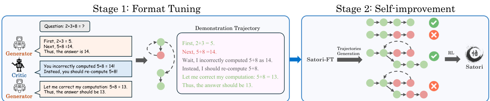  
Figure 1: A High-level Overview of Satori Training Framework: Format Tuning (FT) $^+$ Self-improvement. First, Satori learns COAT reasoning format through imitation learning on small-scale demonstration trajectories. Next, Satori further leverages COAT reasoning format to self-improve via large-scale reinforcement learning.  

# 4. Method  

We start this section by introducing the formulation of reasoning and how reasoning can be formulated as a sequential decision-making problem. Goal: We want to train LLMs to solve problems by reasoning through multiple steps rather than directly predicting the fnal answer. Given a problem statement $\textbf{\em x}$ , the model generates a sequence of reasoning steps $\{y_{1},y_{2},\dots,y_{L}\}$ , where $\pmb{y}_{L}$ provides the fnal answer. However, not all intermediate steps are helpful—repeating errors does not improve accuracy. Effective reasoning requires verifying correctness, identifying mistakes, and considering alternative solutions. For instance, given $\begin{array}{r}{\pmb{x}=\,\,\mathrm{^\infty}1+1=\!?\!\,\!\,^{,}}\end{array}$ , the model might initially output $\pmb{y}_{1}=3$ , then recognize the mistake with $\pmb{y}_{2}$ (e.g., “Wait, let me verify...”), before correcting it to $y_{3}=2$ .  

Chain-of-Action-Thought reasoning (COAT). The key challenge is enabling the model to determine when to refect, continue, or explore alternatives without external intervention. To enable this, we introduce special meta-action tokens that guide the model’s reasoning process beyond standard text generation. These tokens serve as hint for the model to determine when to reassess its reasoning before proceeding.  

Continue Reasoning $\langle<|$ continue $|>\,\rangle$ ): Encourages the model to build upon its current reasoning trajectory by generating the next intermediate step.  

Refect ( $\langle<|$ reflect $|>\,\rangle$ ): Prompts the model to pause and verify the correctness of prior reasoning steps.  

Explore Alternative Solution $(<|\tt{e x p l o r e}\,|>)$ : Signals the model to identify critical faws in its reasoning and explore a new solution.  

Each reasoning step $\textit{\textbf{y l}}$ is a sequence of tokens, with the starting token potentially being one of the designated metaaction tokens. We refer to this formulation as Chain-ofAction-Thought reasoning (COAT). In particular, typical Chain-of-Thought reasoning (CoT) (Wei et al., 2022) can be viewed as a special case of COAT, where each reasoning step in CoT is restricted to continuation, without explicitly incorporating other types of meta-actions.  

Learning to Reason via RL. We formulate reasoning as a sequential decision-making problem, where reasoning is a process of constructing and refning an answer step by step. Specifcally, the model $\pi_{\theta}$ starts with an input context $\textbf{\em x}$ (initial state $z_{0}$ ), generates a reasoning step $\textit{\textbf{y l}}$ (action), updates the context by appending $\textit{\textbf{y l}}$ (next state $z_{l+1}=z_{l}\oplus\pmb{y}_{l}$ , where $\oplus$ denotes string concatenation), and repeats this process until it produces a fnal answer $\pmb{y}_{L}$ . The reasoning terminates when the model signals completion (e.g., omitting EOS token). The simplest reward function can be $\mathbb{I}\{y_{L}\,=\,y^{*}\}$ , evaluates whether the fnal answer $y_{L}$ matches the ground truth $\boldsymbol{y}^{*}$ . With this formulation, we could train the model to reason using RL, aiming to generate reasoning steps that maximize the expected reward. However, applying RL to reasoning presents two key challenges:  

1. Unawareness of meta-action tokens: The model doesn’t understand the purpose of special tokens and fails to recognize that encountering special meta-action tokens may require refection or proposing alternatives.  

2. Long horizon and sparse rewards: Reasoning requires long-term decision-making with rewards only at the end, which hinders learning effectiveness (Bellemare et al., 2016). The model must take many correct reasoning steps before receiving rewards, and failures force it to restart from the initial state (i.e., the problem statement). This makes learning diffcult because training data associated with rewards is scarce, yet rewards are essential for driving RL progress.  

Overview of Proposed Method. To address the model’s initial unawareness of meta-action tokens, we introduce a warm-up “format-tuning” stage: we fne-tune a pre-trained LLM on a small dataset featuring a few demonstrated reasoning trajectories (Section 4.1). This step familiarizes the model with using and reacting to meta-action tokens. Second, to tackle the challenges of long horizons and sparse rewards, we propose a “restart and explore” (RAE) strategy, inspired by Go-explore (Ecoffet et al., 2019). Here, the model restarts from intermediate steps, including those points where previous reasoning attempts failed, allowing it to focus on correcting errors rather than starting from scratch. We also add exploration bonuses to encourage deeper refection, further increasing opportunities for the model to arrive at correct answers (Section 4.2).  

# 4.1. Format Tuning Through Imitation Learning  

Training a base LLM $\pi_{\theta}$ to perform COAT reasoning presents a signifcant challenge: LLMs are typically not pre-trained on COAT reasoning data that incorporates trials and errors, necessitating a post-training stage to inject this capability. To address this, we introduce format tuning (FT), a method designed to train LLMs to emulate expert COAT trajectories through imitation learning. Imitation learning techniques (Hussein et al., 2017) are widely used in the robotics domain, where agents are trained using demonstration trajectories provided by human experts (Ross and Bagnell, 2010; Ross et al., 2011; Ho and Ermon, 2016). However, generating high-quality demonstration trajectories for LLMs is prohibitively expensive for complex tasks. To effciently construct a demonstration trajectory dataset $\mathcal{D}_{\mathrm{syn}}\,=\,\{({\pmb x}^{\dot{(i)}},\pmb{\tilde{y}}^{(i)})\}_{i=1}^{N}$ , we propose a multi-agent data synthesis framework that leverages three LLMs:  

Generator: Given an input problem, a generator $\pi_{g}$ generates multiple reasoning paths for a given input problem using classical CoT techniques. Critic: A critic $\pi_{c}$ evaluates the correctness of the reasoning paths generated by the generator, providing feedback to refne the reasoning and address suboptimal steps. Reward Model: Additionally, a reward model $\pi_{r}$ assigns scores to the refned reasoning paths and selects the most effective path as the fnal demonstration trajectory.  

These three models collaborate to construct high-quality demonstration trajectories (details on the trajectory synthesis are provided in Appendix C). For this work, we adopt the simplest imitation learning approach, behavior cloning, which utilizes supervised fne-tuning to train the LLM policy on the expert COAT demonstration trajectories $\mathcal{D}_{\mathrm{syn}}$ . Notably, we observe that even a small number (10K) of COAT demonstration trajectories is suffcient for $\pi_{\theta}$ to effectively follow the COAT reasoning format.  

# 4.2. Self-improvement via Reinforcement Learning  

After format tuning, the LLM policy $\pi_{\theta}$ adopts the COAT reasoning style but struggles to generalize, particularly in using meta-actions for self-refection. This limitation arises from the scarcity of demonstrations during format tuning. While collecting more demonstrations could help, it is costly and time-consuming. Instead, we explore whether the model can self-improve its reasoning via RL.  

We start with the format-tuned LLM and train it using PPO (Schulman et al., 2017b) algorithm, a widely used RL method. In addition to training on problems $\textbf{\em x}$ from the dataset $\mathcal{D}$ , we also train the model $\pi_{\theta}$ to begin reasoning from partial trajectories generated by the format-tuned LLM. Since reasoning errors typically arise from minor mistakes rather than fundamental faws, re-exploring from the start is ineffcient. Instead, we allow the model to restart from intermediate steps to correct errors and fnally achieve correct answers. Inspired by Go-Explore (Ecoffet et al., 2019), we introduce the Restart and Explore (RAE) strategy.  

Algorithm 1 Restart and Explore (RAE)   
input Dataset $\mathcal{D}\;=\;\{(\pmb{x}^{(i)},\pmb{y}^{\ast(i)})\}_{i=1}^{n}$ ; LLM policy $\pi_{\theta}$ after   
format tuning; maximum back-track steps $T$   
▷ Initialize $\mathcal{D}_{\mathrm{restart}}^{+}\leftarrow\emptyset$ ; Initialize $\ensuremath{\mathcal{D}}_{\mathrm{restart}}^{-}\leftarrow\emptyset$   
for $i=1,2,\dots,n$ do $\triangleright$ Given input problem $\pmb{x}^{(i)}$ , sample $\pi_{\theta}$ and collect multiple initial trajectories. $\triangleright$ Randomly select one correct trajectory $\tilde{y}^{+}$ and one incorrect trajectory $\tilde{y}^{-}$ . $\triangleright$ Randomly backtrack last $t\leq T$ actions from $\tilde{y}^{+}$ and $\tilde{y}^{-}$ . ▷ Obtain intermediate states at time-step $L-t$ , $z_{L-t}^{+}\ =$ $[{\pmb x}^{(i)},\tilde{{\pmb y}}_{1}^{+},\tilde{{\pmb y}}_{2}^{+},\dots,\tilde{{\pmb y}}_{L-t}^{+}]$ ; $z_{L-t}^{-}=[\pmb{x}^{(i)},\pmb{\tilde{y}}_{1}^{-},\pmb{\tilde{y}}_{2}^{-},\dots,\pmb{\tilde{y}}_{L-t}^{-}]$ . ▷ Add “refect” special token to trigger self-refection action, $z_{L-t}^{+}=[\pmb{x}^{(i)},\pmb{\tilde{y}}_{1}^{+},\pmb{\tilde{y}}_{2}^{+},\dots,\pmb{\tilde{y}}_{L-t}^{+},<|\mathtt{\tilde{\ p}e f l e c t}|$ $|>]$ ; $z_{L-t}^{-}=$ $[\pmb{x}^{(i)},\pmb{\tilde{y}}_{1}^{-},\pmb{\tilde{y}}_{2}^{-},\dots,\pmb{\tilde{y}}_{L-t}^{-},<|\ x\ominus\mathbb{f}1\mathrm{ec}$ t|>]. $\triangleright$ Update $\mathcal{D}_{\mathrm{restart}}^{+}\leftarrow\mathcal{D}_{\mathrm{restart}}^{+}\cup z_{L-t}^{+}$ ; $\mathcal{D}_{\mathrm{restart}}^{-}\leftarrow\mathcal{D}_{\mathrm{restart}}^{-}\cup z_{L-t}^{-}$ .   
end   
$\mathcal{D}_{\mathrm{restart}}=\{\pmb{x}^{(i)}\}_{i=1}^{n}\cup\mathcal{D}_{\mathrm{restart}}^{+}\cup\mathcal{D}_{\mathrm{restart}}^{-}.$  

output Augmented initial states dataset $\mathcal{D}_{\mathrm{restart}}$  

Initial States. RAE trains the model to reason not only from the problem statement but also from intermediate steps sampled from past trajectories, both correct and incorrect. This enables deeper exploration without redundant recomputation. As detailed in Algorithm 1, given an input problem $x\in\mathcal{D}$ , the format-tuned LLM frst generates multiple reasoning trajectories. We then randomly backtrack $T\geq0$ steps and append a refect token $<\mid{\tt r e f l e c t}\mid>$ to prompt the model to refne its reasoning. To encourage diverse exploration, correct and incorrect trajectories are stored separately in restart buffers $\mathcal{D}_{\mathrm{restart}}^{+}$ and $\mathcal{D}_{\mathrm{restart}}^{-}$ ). RL training then optimizes reasoning across these buffers along with the original problem dataset, sampling initial states from the merged dataset $\mathcal{D}_{\mathrm{restart}}$ .  

Reward Design. RAE gives the model multiple opportunities to refne its reasoning, but effective refection is key to making use of these chances. In addition to using correctness as rewards, we introduce the following bonuses rewards as hints to guide the model to reach correct answers:  

Rule-based Reward: Rule-based reward simply evaluates the correctness of the fnal answer.  

$$
r_{\mathrm{rule}}(\tilde{\pmb{y}}_{L},\pmb{y}^{\ast})=\mathbf{1}_{\tilde{\pmb{y}}_{L}=\pmb{y}^{\ast}}-1\in\{-1,0\}
$$  

Refection Bonuses: To reinforce self-refection, we introduce a refection bonus $r_{\mathrm{bonus}}$ . If the model starts from an incorrect reasoning trajectory stored in the negative restart buffer $(\mathcal{D}_{\mathrm{restart}}^{-})$ and successfully solves the problem, it obtains a reward bonus, encouraging it to correct past mistakes. Conversely, if it starts from a correct trajectory in the positive restart buffer $(\mathcal{D}_{\mathrm{restart}}^{+})$ but fails to solve the problem, it incurs a penalty, discouraging unnecessary revisions when it was already on the right track. Formally, the refection bonus is defned as:  

$$
\begin{array}{r}{r_{\mathrm{bonus}}(z,\tilde{\boldsymbol{y}})=\left\{\begin{array}{l l}{\beta}&{\mathrm{if~}z\in\mathcal{D}_{\mathrm{restart}}^{-}\mathrm{~and~}\tilde{y}_{L}=y^{*},}\\ {-\beta}&{\mathrm{if~}z\in\mathcal{D}_{\mathrm{restart}}^{+}\mathrm{~and~}\tilde{y}_{L}\neq y^{*},}\\ {0}&{\mathrm{otherwise},}\end{array}\right.}\end{array}
$$  

where $\beta$ is a bonus scale hyperparameter.  

Preference Bonuses: Since correct answers are rare at initial training stage, reward signals are often too sparse for effective RL training. Even with refection, the model may fail to generate any correct reasoning trajectories, resulting in a sparse reward problem. To mitigate this, we train an Outcome Reward Model (ORM) using a BradleyTerry (BT) preference framework. The ORM rates reasoning trajectories, assigning higher values to correct (preferred) ones. For each problem $\pmb{x}\in\mathcal{D}$ , we generate multiple trajectories using $\pi_{\theta}$ and construct a preference dataset by pairing correct and incorrect outputs. A BT model is trained to maximize the score gap between these pairs. The ORM’s output, $\sigma\big(r_{\psi}(z,\tilde{\pmb y})\big)\in[0,1]$ , serves as a fne-grained reward signal, helping the model further refne its reasoning. See Appendix D.3 for details.  

For an initial state $z\in\mathcal{D}_{\mathrm{restart}}$ and a sampled trajectory $\tilde{\b{y}}$ , the overall reward function $r(z,\tilde{y})$ is defned as:  

$$
r(z,\tilde{y})=r_{\mathrm{rule}}(\tilde{y}_{L},y^{*})+\sigma\big(r_{\psi}(z,\tilde{y})\big)+r_{\mathrm{bonus}}(z,\tilde{y})
$$  

Iterative Self-improvement. RL enables a policy to selfimprove from self-generated trajectories, but it can also lead to a vicious cycle, where the policy converges to a local sub-optimum and cannot further improve. Inspired by (Agarwal et al., 2022; Schmitt et al., 2018), we propose an iterative self-improvement strategy to mitigate this issue. Specifcally, after each round of RL training, we distill the knowledge of the current well-optimized policy into the base model through supervised fne-tuning (SFT). Starting from the newly fne-tuned model, we then perform another round of RL training. Intuitively, from an optimization perspective, each round of distillation can be viewed as a parameter reset mechanism that helps the policy escape local optima in the loss landscape, allowing it to continue self-improving (more details are included in Section D.3). In the next section, we provide empirical evidence to validate this approach.  

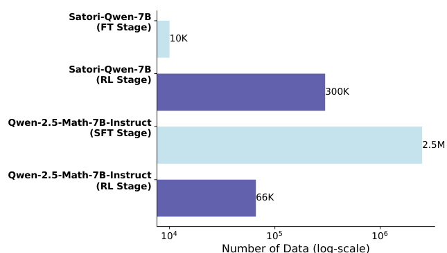  
Figure 2: Number of Training Samples of Satori-Qwen-7B and Qwen-2.5-Math-7B-Instruct. Satori-Qwen-7B requires signifcantly less supervision (small-scale FT) and relies more on self-improvement (large-scale RL).  

# 5. Experiment  

Implementation Details. We employ Qwen-2.5-Math-7B as the base model due to its strong mathematical capabilities. Our training data is sourced from the publicly available math instruction datasets, OpenMathInstruct-2 and NuminaMathCoT. For the multi-agent data synthesis framework, the generator is required to generate high-quality, step-by-step reasoning trajectories. Therefore, we use Qwen-2.5-MathInstruct as the generator. Meanwhile, the critic must have robust instruction-following capabilities, so we choose Llama3.1-70B-Instruct as the critic. To ensure data quality, we flter out problems with invalid questions or incorrect labels, resulting in approximately 550k samples. Additional implementation details can be found in Appendix D.  

Benchmark and Evaluation. We conduct the main evaluation of the models using math benchmarks to assess their problem-solving abilities, including GSM8K, MATH500 (a subset of the MATH test set (Lightman et al., 2023)), AMC2023, AIME2024, and OlympiadBench. Except for GSM8K, all other datasets feature competition-level problems. The evaluation is performed using greedy decoding without tool integration. The main metric reported is the zero-shot pass $@1$ accuracy, which measures the percentage of problems correctly solved on the frst attempt. We also conduct additional evaluations on a wide range of benchmarks beyond the math domain to evaluate general reasoning capabilities. This includes logical reasoning (FOLIO (Han et al., 2024), BoardgameQA (BGQA) (Kazemi et al., 2024)), code reasoning (CRUXEval (Gu et al., 2024)), commonsense reasoning (StrategyQA (STGQA) (Geva et al., 2021)), tabular reasoning (TableBench (Wu et al., 2024a)), and domain-specifc reasoning (STEM subsets of MMLUPro (Wang et al., 2024b)), including physics, chemistry, computer science, engineering, biology, and economics. For more evaluation details, please refer to Appendix D.4.  

Table 1: Results on Mathematic Benchmarks. Satori-Qwen-7B achieves SOTA performance across fve benchmarks, and outperforms Qwen-2.5-Math-7B-Instruct which uses the same base model Qwen-2.5-Math-7B. After round-2 training, Satori-Qwen-7B (Round 2) demonstrates even stronger performance on hard tasks.   

<html><body><table><tr><td>Scale</td><td>Model</td><td>GSM8K</td><td>MATH500</td><td>OlympiadBench</td><td>AMC2023</td><td>AIME2024</td><td>Avg.</td></tr><tr><td rowspan="5">Large</td><td>GPT-40</td><td>/</td><td>60.3</td><td>43.3</td><td>/</td><td>9.3</td><td>/</td></tr><tr><td>o1-preview</td><td>/</td><td>85.5</td><td>/</td><td>82.5</td><td>44.6</td><td>/</td></tr><tr><td>Llama-3.1-70B-Instruct</td><td>94.1</td><td>68.0</td><td>29.4</td><td>42.5</td><td>13.3</td><td>49.5</td></tr><tr><td>OpenMath2-Llama3.1-70B</td><td>94.1</td><td>71.8</td><td>30.1</td><td>45.0</td><td>13.3</td><td>50.9</td></tr><tr><td>QwQ-32B-Preview</td><td>95.5</td><td>90.6</td><td>61.2</td><td>77.5</td><td>50.0</td><td>75.0</td></tr><tr><td rowspan="7">Small</td><td>Llama-3.1-8b-Instruct</td><td>84.4</td><td>51.9</td><td>15.1</td><td>22.5</td><td>3.3</td><td>35.4</td></tr><tr><td>OpenMath2-Llama3.1-8B</td><td>90.5</td><td>67.8</td><td>28.9</td><td>37.5</td><td>6.7</td><td>46.3</td></tr><tr><td>NuminaMath-7B-CoT</td><td>78.9</td><td>54.6</td><td>15.9</td><td>20.0</td><td>10.0</td><td>35.9</td></tr><tr><td>Qwen-2.5-7B-Instruct</td><td>91.6</td><td>75.5</td><td>35.5</td><td>52.5</td><td>6.7</td><td>52.4</td></tr><tr><td>Qwen-2.5-Math-7B-Instruct</td><td>95.2</td><td>83.6</td><td>41.6</td><td>62.5</td><td>16.7</td><td>59.9</td></tr><tr><td>Satori-Qwen-7B</td><td>93.2</td><td>85.6</td><td>46.6</td><td>67.5</td><td>20.0</td><td>62.6</td></tr><tr><td>Satori-Qwen-7B (Round 2)</td><td>93.9</td><td>83.6</td><td>48.5</td><td>72.5</td><td>23.3</td><td>64.4</td></tr></table></body></html>  

Table 2: Results on Out-of-domain Benchmarks. Trained only on math datasets, Satori-Qwen-7B exhibits strong transferability across diverse out-of-domain benchmarks and outperforms Qwen-2.5-Math-7B-Instruct by a large margin. Moreover, despite not being trained in other domains, Satori-Qwen-7B achieves performance comparable to or exceeding other small-scale general instruct models.   

<html><body><table><tr><td>Scale</td><td>Model</td><td>FOLIO</td><td>BGQA</td><td>CRUXEval</td><td>StrategyQA</td><td>TableBench</td><td>STEM</td><td>Avg.</td></tr><tr><td rowspan="4">Large</td><td>Llama-3.1-70B-Instruct</td><td>65.0</td><td>58.3</td><td>59.6</td><td>88.8</td><td>34.2</td><td>61.7</td><td>61.3</td></tr><tr><td>OpenMath2-Llama3.1-70B</td><td>68.5</td><td>68.7</td><td>35.1</td><td>95.6</td><td>46.8</td><td>15.1</td><td>55.0</td></tr><tr><td>QwQ-32B-Preview</td><td>84.2</td><td>71.1</td><td>65.2</td><td>88.2</td><td>51.5</td><td>71.3</td><td>71.9</td></tr><tr><td>Llama-3.1-8b-Instruct</td><td>63.5</td><td>50.3</td><td>38.5</td><td>92.2</td><td>32.4</td><td>43.4</td><td>53.4</td></tr><tr><td rowspan="6">Small</td><td>OpenMath2-Llama3.1-8B</td><td>57.1</td><td>49.0</td><td>11.1</td><td>84.4</td><td>34.2</td><td>10.9</td><td>41.1</td></tr><tr><td>NuminaMath-7B-CoT</td><td>53.2</td><td>44.6</td><td></td><td></td><td></td><td>11.3</td><td>40.7</td></tr><tr><td>Qwen-2.5-7B-Instruct</td><td>72.4</td><td>53.0</td><td>28.0</td><td>77.8 91.3</td><td>29.1</td><td>57.1</td><td>62.5</td></tr><tr><td>Qwen-2.5-Math-7B-Instruct</td><td>68.9</td><td>51.3</td><td>58.1 28.0</td><td>85.3</td><td>43.2 36.2</td><td>45.2</td><td>52.5</td></tr><tr><td></td><td></td><td></td><td></td><td></td><td></td><td></td><td></td></tr><tr><td>Satori-Qwen-7B Satori-Qwen-7B (Round 2)</td><td>71.4 72.9</td><td>61.8 58.5</td><td>42.5 41.1</td><td>86.3 90.4</td><td>43.4 44.6</td><td>56.7 57.4</td><td>60.4 60.8</td></tr></table></body></html>  

Baseline Models. We compare our developed model, Satori-Qwen-7B, with several industry-developed LLMs. The main comparison is between our model and Qwen-2.5- Math-7B-Instruct (Yang et al., 2024a), a math-specialized model built on the same base model (Qwen-2.5-Math-7B) as ours. Additionally, we report the performance of larger models, including o1-preview and QwQ-32B-Preview, which exhibit strong reasoning capabilities and serve as performance upper bounds.  

# 5.1. Main Results on Math Domain  

We present math benchmark results in Table 1, where Satori-Qwen-7B outperforms all small-scale baseline models. Notably, using Qwen-2.5-Math-7B as the base model, Satori-Qwen-7B achieves superior performance compared to Qwen-2.5-Math-7B-Instruct, despite requiring signifcantly less supervision (i.e., less SFT data) and relying more on self-improvement (i.e., more RL data) (see Figure 2).  

# 5.2. Out-of-Domain Transferability  

Although Satori-Qwen-7B is trained only on math domain datasets, we observe that it can extrapolate its reasoning capabilities to other domains. In Table 2, we evaluate SatoriQwen-7B on a diverse set of out-of-domain benchmarks that require reasoning capabilities but are not directly related to math. Similar to the observation on the math domain, Satori demonstrates superior performance on several benchmarks, outperforming Qwen-2.5-Math-7B-Instruct. In particular, on the challenging reasoning benchmark BoardgameQA, Satori-Qwen-7B surpasses all baseline models of the same scale. These results and demo examples in Appendix A suggest that Satori has acquired general reasoning capabilities rather than simply math problem solving skills. In Section 6, we present further analysis to show that this transferability emerges as a result of large-scale reinforcement learning.  

# 5.3. Results on Iterative Self-improvement  

Finally, we present the results of the second-round training of Satori. As shown in Table 1 and Table 2, compared to Satori-Qwen-7B, Satori-Qwen-7B (Round 2) demonstrates continuous performance gains across most in-domain and out-of-domain benchmarks. This suggests the signifcant potential of iterative self-improvement to push the limit of LLM’s reasoning performance.  

# 6. Analysis  

In this section, we provide a comprehensive analysis of Satori. First, we demonstrate that Satori effectively leverages self-refection to seek better solutions and enhance its overall reasoning performance. Next, we observe that Satori exhibits test-scaling behavior through RL training, where it progressively acquires more tokens to improve its reasoning capabilities. Finally, we conduct ablation studies on various components of Satori’s training framework. Additional results are provided in Appendix E.  

Table 3: COAT Training v.s. CoT Training. Qwen-2.5-Math-7B trained with COAT reasoning format (Satori-Qwen-7B) outperforms the same base model but trained with classical CoT reasoning format (Qwen-7B-CoT)   

<html><body><table><tr><td>Model</td><td colspan="5">GSM8K MATH500Olym.AMC2023AIME2024</td></tr><tr><td>Qwen-2.5-Math-7B-Instruct</td><td>95.2</td><td>83.6</td><td>41.6</td><td>62.5</td><td>16.7</td></tr><tr><td>Qwen-7B-CoT (SFT+RL)</td><td>93.1</td><td>84.4</td><td>42.7</td><td>60.0</td><td>10.0</td></tr><tr><td>Satori-Qwen-7B</td><td>93.2</td><td>85.6</td><td>46.6</td><td>67.5</td><td>20.0</td></tr></table></body></html>  

COAT Reasoning v.s. CoT Reasoning. We begin by conducting an ablation study to demonstrate the benefts of COAT reasoning compared to the classical CoT reasoning. Specifcally, starting from the synthesis of demonstration trajectories in the format tuning stage, we ablate the “refect” and “explore” actions, retaining only the “continue” actions. Next, we maintain all other training settings, including the same amount of SFT and RL data and consistent hyper-parameters. This results in a typical CoT LLM (Qwen-7B-CoT) without self-refection or self-exploration capabilities. As shown in Table 3, the performance of Qwen7B-CoT is suboptimal compared to Satori-Qwen-7B and fails to surpass Qwen-2.5-Math-7B-Instruct, suggesting the advantages of COAT reasoning over CoT reasoning.  

Table 4: Satori’s Self-correction Capability. $\mathrm{T}{\rightarrow}\mathrm{F}_{}$ : negative self-correction; $\operatorname{F}\!\to\!\operatorname{T}\!\cdot$ positive self-correction.   

<html><body><table><tr><td rowspan="3">Model</td><td colspan="4">In-Domain</td><td colspan="2">Out-of-Domain</td></tr><tr><td colspan="2">MATH500</td><td colspan="2">OlympiadBench</td><td colspan="2">MMLUProSTEM</td></tr><tr><td>T→→F</td><td>F→→T</td><td>T→F</td><td>F→→T</td><td>T→F</td><td>F→T</td></tr><tr><td>Satori-Qwen-7B-FT</td><td>79.4%</td><td>20.6%</td><td>65.6%</td><td>34.4%</td><td>59.2%</td><td>40.8%</td></tr><tr><td>Satori-Qwen-7B</td><td>39.0%</td><td>61.0%</td><td>42.1%</td><td>57.9%</td><td>46.5%</td><td>53.5%</td></tr></table></body></html>  

Satori Exhibits Self-correction Capability. We observe that Satori frequently engages in self-refection during the reasoning process (see demos in Section A), which occurs in two scenarios: (1) it triggers self-refection at intermediate reasoning steps, and (2) after completing a problem, it initiates a second attempt through self-refection. We focus on quantitatively evaluating Satori’s self-correction capability in the second scenario. Specifcally, we extract responses where the fnal answer before self-refection differs from the answer after self-refection. We then quantify the percentage of responses in which Satori’s self-correction is positive (i.e., the solution is corrected from incorrect to correct) or negative (i.e., the solution changes from correct to incorrect). The evaluation results on in-domain datasets (MATH500 and Olympiad) and out-of-domain datasets (MMLUPro) are presented in Table 4. First, compared to Satori-Qwen-FT which lacks the RL training stage, Satori-Qwen demonstrates a signifcantly stronger self-correction capability. Second, we observe that this self-correction capability extends to out-of-domain tasks (MMLUProSTEM). These results suggest that RL plays a crucial role in enhancing the model’s true reasoning capabilities.  

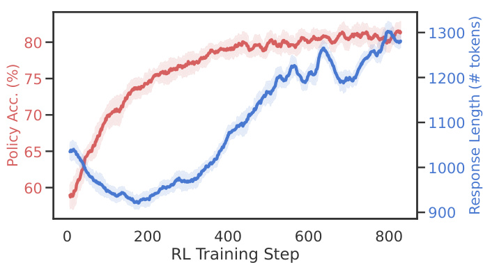  
Figure 3: Policy Training Acc. & Response length v.s. RL Traintime Compute. Through RL training, Satori learns to improve its reasoning performance through longer thinking.  

RL Enables Satori with Test-time Scaling Behavior. Next, we aim to explain how reinforcement learning (RL) incentivizes Satori’s autoregressive search capability. First, as shown in Figure 3, we observe that Satori consistently improves policy accuracy and increases the average length of generated tokens with more RL training-time compute. This suggests that Satori learns to allocate more time to reasoning, thereby solving problems more accurately. One interesting observation is that the response length frst decreases from 0 to 200 steps and then increases. Upon a closer investigation of the model response, we observe that in the early stage, our model has not yet learned self-refection capabilities. During this stage, RL optimization may prioritize the model to fnd a shot-cut solution without redundant refection, leading to a temporary reduction in response length. However, in later stage, the model becomes increasingly good at using refection to self-correct and fnd a better solution, leading to a longer response length.  

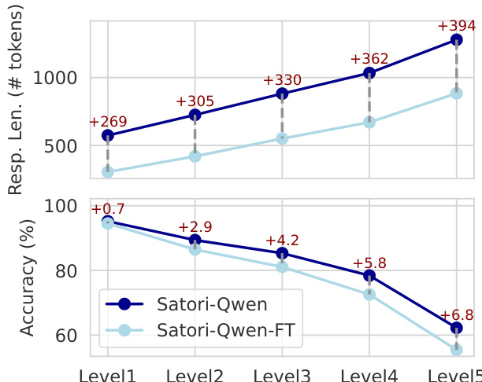  
Figure 4: Above: Test-time Response Length v.s. Problem Diffculty Level; Below: Test-time Accuracy v.s. Problem Diffculty Level. Compared to FT model (Satori-Qwen-FT), Satori-Qwen uses more test-time compute to tackle more challenging problems.  

Additionally, in Figure 4, we evaluate Satori’s test accuracy and response length on MATH datasets across different diffculty levels. Interestingly, through RL training, Satori naturally allocates more test-time compute to tackle more challenging problems, which leads to consistent performance improvements compared to the format-tuned (FT) model.  

Table 5: Large-scale FT V.S. Large-scale RL Satori-Qwen (10K FT data $+\,300\mathrm{K}$ RL data) outperforms same base model Qwen-2.5- Math-7B trained with 300K FT data (w/o RL) across all math and out-of-domain benchmarks.   

<html><body><table><tr><td>(In-domain)</td><td>GSM8KMATH500</td><td></td><td>Olym.</td><td>AMC2023</td><td>AIME2024</td></tr><tr><td>Qwen-2.5-Math-7B-Instruct</td><td>95.2</td><td>83.6</td><td>41.6</td><td>62.5</td><td>16.7</td></tr><tr><td>Satori-Qwen-7B-FT(300K)</td><td>92.3</td><td>78.2</td><td>40.9</td><td>65.0</td><td>16.7</td></tr><tr><td>Satori-Qwen-7B</td><td>93.2</td><td>85.6</td><td>46.6</td><td>67.5</td><td>20.0</td></tr><tr><td>(Out-of-domain)</td><td>BGQA</td><td>CRUX</td><td></td><td>STGQATableBench</td><td>STEM</td></tr><tr><td>Qwen-2.5-Math-7B-Instruct</td><td>51.3</td><td>28.0</td><td>85.3</td><td>36.3</td><td>45.2</td></tr><tr><td>Satori-Qwen-7B-FT(300K)</td><td>50.5</td><td>29.5</td><td>74.0</td><td>35.0</td><td>47.8</td></tr><tr><td>Satori-Qwen-7B</td><td>61.8</td><td>42.5</td><td>86.3</td><td>43.4</td><td>56.7</td></tr></table></body></html>  

Large-scale FT v.s. Large-scale RL. We investigate whether scaling up format tuning (FT) can achieve performance gains comparable to RL training. We conduct an ablation study using Qwen-2.5-Math-7B, trained with an equivalent amount of FT data (300K). As shown in Table 5, on the math domain benchmarks, the model trained with large-scale FT (300K) fails to match the performance of the model trained with small-scale FT (10K) and large-scale RL (300K). Additionally, the large-scale FT model performs signifcantly worse on out-of-domain tasks, demonstrates RL’s advantage in generalization.  

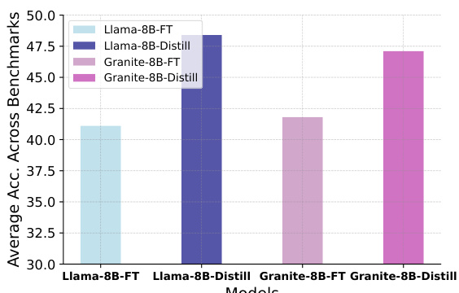  
Figure 5: Format Tuning v.s. Distillation. Distilling from a Stronger model (Satori-Qwen-7B) to weaker base models (Llama8B and Granite-8B) are more effective than directly applying format tuning on weaker base models.  

Distillation Enables Weak-to-Strong Generalization. Finally, we investigate whether distilling a stronger reasoning model can enhance the reasoning performance of weaker base models. Specifcally, we use Satori-Qwen-7B to generate 240K synthetic data to train weaker base models, Llama-3.1-8B and Granite-3.1-8B. For comparison, we also synthesize 240K FT data (following Section 4.1) to train the same models. We evaluate the average test accuracy of these models across all math benchmark datasets, with the results presented in Figure 5. The results show that the distilled models outperform the format-tuned models.  

This suggests a new, effcient approach to improve the reasoning capabilities of weaker base models: (1) train a strong reasoning model through small-scale FT and large-scale RL (our Satori-Qwen-7B) and (2) distill the strong reasoning capabilities of the model into weaker base models. Since RL only requires answer labels as supervision, this approach introduces minimal costs for data synthesis, i.e., the costs induced by a multi-agent data synthesis framework or even more expensive human annotation.  

# 7. Concluding Remarks  

The training framework of Satori exhibits signifcant potential for enhancing LLM reasoning capabilities. The smallscale format tuning stage serves as a warm-up phase, allowing the LLM policy to internalize a specifc reasoning format, while large-scale reinforcement learning (RL) plays a crucial role in incentivizing intrinsic reasoning abilities. We believe that this framework can inspire the research community to explore more methods for achieving autoregressive search, such as developing reasoning formats with a broader range of meta-actions, designing more advanced RL algorithms, and extending this approach to general domain.  

# References  

K. Cobbe, V. Kosaraju, M. Bavarian, M. Chen, H. Jun, L. Kaiser, M. Plappert, J. Tworek, J. Hilton, R. Nakano et al., “Training verifers to solve math word problems,” arXiv preprint arXiv:2110.14168, 2021. 1, 24, 36   
D. Hendrycks, C. Burns, S. Kadavath, A. Arora, S. Basart, E. Tang, D. Song, and J. Steinhardt, “Measuring mathematical problem solving with the MATH dataset,” in Thirty-ffth Conference on Neural Information Processing Systems Datasets and Benchmarks Track (Round 2), 2021. 1, 2, 24, 36   
M. Chen, J. Tworek, H. Jun, Q. Yuan, H. P. D. O. Pinto, J. Kaplan, H. Edwards, Y. Burda, N. Joseph, G. Brockman et al., “Evaluating large language models trained on code,” arXiv preprint arXiv:2107.03374, 2021. 1, 24   
T. Y. Zhuo, M. C. Vu, J. Chim, H. Hu, W. Yu, R. Widyasari, I. N. B. Yusuf, H. Zhan, J. He, I. Paul et al., “Bigcodebench: Benchmarking code generation with diverse function calls and complex instructions,” arXiv preprint arXiv:2406.15877, 2024. 1, 24   
S. Han, H. Schoelkopf, Y. Zhao, Z. Qi, M. Riddell et al., “FOLIO: Natural language reasoning with frst-order logic,” in Proceedings of the 2024 Conference on Empirical Methods in Natural Language Processing, Y. AlOnaizan, M. Bansal, and Y.-N. Chen, Eds. Miami, Florida, USA: Association for Computational Linguistics, November 2024, pp. 22 017–22 031. 1, 6, 24, 36   
J. Liu, L. Cui, H. Liu, D. Huang, Y. Wang, and Y. Zhang, “LogiQA: A challenge dataset for machine reading comprehension with logical reasoning,” in Proceedings of the Twenty-Ninth International Joint Conference on Artifcial Intelligence, IJCAI 2020, C. Bessiere, Ed. ijcai.org, 2020, pp. 3622–3628. 1, 24   
J. Wei, X. Wang, D. Schuurmans, M. Bosma, F. Xia, E. Chi, Q. V. Le, D. Zhou et al., “Chain-of-thought prompting elicits reasoning in large language models,” Advances in neural information processing systems, vol. 35, pp. 24 824–24 837, 2022. 1, 3, 24   
X. Yue, X. Qu, G. Zhang, Y. Fu, W. Huang, H. Sun, Y. Su, and W. Chen, “MAmmoTH: Building math generalist models through hybrid instruction tuning,” in The Twelfth International Conference on Learning Representations, ICLR 2024, Vienna, Austria, May 7-11, 2024. OpenReview.net, 2024. 1, 2, 24   
L. Yu, W. Jiang, H. Shi, J. Yu, Z. Liu, Y. Zhang, J. T. Kwok, Z. Li, A. Weller, and W. Liu, “MetaMath: Bootstrap your own mathematical questions for large language models,” in The Twelfth International Conference on Learning Representations, ICLR 2024, Vienna, Austria, May 7-11, 2024. OpenReview.net, 2024. 1, 2, 24   
S. Toshniwal, W. Du, I. Moshkov, B. Kisacanin, A. Ayrapetyan, and I. Gitman, “Openmathinstruct-2: Accelerating AI for math with massive open-source instruction data,” arXiv preprint arXiv:2410.01560, 2024. 1, 2, 24, 27   
Y. Ding, X. Shi, X. Liang, J. Li, Q. Zhu, and M. Zhang, “Unleashing reasoning capability of llms via scalable question synthesis from scratch,” arXiv preprint arXiv:2410.18693, 2024. 1, 2, 24   
X. Wang, J. Wei, D. Schuurmans, Q. V. Le, E. H. Chi, S. Narang, A. Chowdhery, and D. Zhou, “Selfconsistency improves chain of thought reasoning in language models,” in The Eleventh International Conference on Learning Representations, 2023. 1   
S. Yao, D. Yu, J. Zhao, I. Shafran, T. Griffths, Y. Cao, and K. Narasimhan, “Tree of thoughts: Deliberate problem solving with large language models,” Advances in Neural Information Processing Systems, vol. 36, 2024. 1, 2, 24   
Z. Wan, X. Feng, M. Wen, S. M. McAleer, Y. Wen, W. Zhang, and J. Wang, “Alphazero-like tree-search can guide large language model decoding and training,” in Forty-frst International Conference on Machine Learning, 2024. 1   
Z. Sun, L. Yu, Y. Shen, W. Liu, Y. Yang, S. Welleck, and C. Gan, “Easy-to-hard generalization: Scalable alignment beyond human supervision,” in The Thirty-eighth Annual Conference on Neural Information Processing Systems, 2024. 1, 2, 24   
P. Wang, L. Li, Z. Shao, R. Xu, D. Dai, Y. Li, D. Chen, Y. Wu, and Z. Sui, “Math-Shepherd: Verify and reinforce LLMs step-by-step without human annotations,” in Proceedings of the 62nd Annual Meeting of the Association for Computational Linguistics (Volume 1: Long Papers), L.-W. Ku, A. Martins, and V. Srikumar, Eds. Bangkok, Thailand: Association for Computational Linguistics, August 2024, pp. 9426–9439. 1, 2, 24   
OpenAI, “Learning to reason with llms,” 2024, accessed: 2024-12-18. [Online]. Available: https://openai.com/ index/learning-to-reason-with-llms/ 2   
Z. Huang, H. Zou, X. Li, Y. Liu, Y. Zheng, E. Chern, S. Xia, Y. Qin, W. Yuan, and P. Liu, “O1 replication journey–part 2: Surpassing o1-preview through simple distillation, big progress or bitter lesson?” arXiv preprint arXiv:2411.16489, 2024. 2, 24   
Y. Zhao, H. Yin, B. Zeng, H. Wang, T. Shi, C. Lyu, L. Wang, W. Luo, and K. Zhang, “Marco-o1: Towards open reasoning models for open-ended solutions,” arXiv preprint arXiv:2411.14405, 2024. 2, 24   
Y. Min, Z. Chen, J. Jiang, J. Chen, J. Deng, Y. Hu, Y. Tang, J. Wang, X. Cheng, H. Song et al., “Imitate, explore, and self-improve: A reproduction report on slow-thinking reasoning systems,” arXiv preprint arXiv:2412.09413, 2024. 2, 24   
D. Guo, D. Yang, H. Zhang, J. Song, R. Zhang, R. Xu, Q. Zhu, S. Ma, P. Wang, X. Bi et al., “DeepSeek-R1: Incentivizing reasoning capability in llms via reinforcement learning,” arXiv preprint arXiv:2501.12948, 2025. 2   
E. Zelikman, Y. Wu, J. Mu, and N. D. Goodman, “STaR: Bootstrapping reasoning with reasoning,” in Advances in Neural Information Processing Systems 35: Annual Conference on Neural Information Processing Systems 2022, NeurIPS 2022, New Orleans, LA, USA, November 28 - December 9, 2022, S. Koyejo, S. Mohamed, A. Agarwal, D. Belgrave, K. Cho, and A. Oh, Eds., 2022. 2, 24   
E. Zelikman, G. R. Harik, Y. Shao, V. Jayasiri, N. Haber, and N. Goodman, “Quiet-STaR: Language models can teach themselves to think before speaking,” in First Conference on Language Modeling, 2024. 2, 24   
A. Singh, J. D. Co-Reyes, R. Agarwal, A. Anand, P. Patil, X. Garcia, P. J. Liu, J. Harrison et al., “Beyond human data: Scaling self-training for problem-solving with language models,” Trans. Mach. Learn. Res., vol. 2024, 2024. 2, 24   
X. Zhang, C. Du, T. Pang, Q. Liu, W. Gao, and M. Lin, “Chain of preference optimization: Improving chain-ofthought reasoning in LLMs,” in The Thirty-eighth Annual Conference on Neural Information Processing Systems, 2024. 2, 24   
J. Schulman, F. Wolski, P. Dhariwal, A. Radford, and O. Klimov, “Proximal policy optimization algorithms,” arXiv preprint arXiv:1707.06347, 2017. 2, 24, 35   
L. Ouyang, J. Wu, X. Jiang, D. Almeida, C. L. Wainwright, P. Mishkin, C. Zhang, S. Agarwal, K. Slama, A. Ray, J. Schulman, J. Hilton, F. Kelton, L. Miller, M. Simens, A. Askell, P. Welinder, P. F. Christiano, J. Leike, and R. Lowe, “Training language models to follow instructions with human feedback,” in Advances in Neural Information Processing Systems 35: Annual Conference on Neural Information Processing Systems 2022, NeurIPS 2022, New Orleans, LA, USA, November 28 - December 9, 2022, S. Koyejo, S. Mohamed, A. Agarwal, D. Belgrave, K. Cho, and A. Oh, Eds., 2022. 2, 24   
L. Yuan, W. Li, H. Chen, G. Cui, N. Ding, K. Zhang, B. Zhou, Z. Liu, and H. Peng, “Free process rewards without process labels,” arXiv preprint arXiv:2412.01981, 2024. 2, 24   
N. Shinn, F. Cassano, A. Gopinath, K. Narasimhan, and S. Yao, “Refexion: Language agents with verbal reinforcement learning,” Advances in Neural Information Processing Systems, vol. 36, 2024. 2, 24   
S. Hao, Y. Gu, H. Ma, J. J. Hong, Z. Wang, D. Z. Wang, and Z. Hu, “Reasoning with language model is planning with world model,” in Proceedings of the 2023 Conference on Empirical Methods in Natural Language Processing, EMNLP 2023, Singapore, December 6-10, 2023, H. Bouamor, J. Pino, and K. Bali, Eds. Association for Computational Linguistics, 2023, pp. 8154–8173. 2, 24   
Z. Qi, M. Ma, J. Xu, L. L. Zhang, F. Yang, and M. Yang, “Mutual reasoning makes smaller llms stronger problemsolvers,” arXiv preprint arXiv:2408.06195, 2024. 2, 24, 27   
Y. Zhang, M. Khalifa, L. Logeswaran, J. Kim, M. Lee, H. Lee, and L. Wang, “Small language models need strong verifers to self-correct reasoning,” in Findings of the Association for Computational Linguistics, ACL 2024, Bangkok, Thailand and virtual meeting, August 11-16, 2024, L. Ku, A. Martins, and V. Srikumar, Eds. Association for Computational Linguistics, 2024, pp. 15 637– 15 653. 2, 24   
R. Kamoi, Y. Zhang, N. Zhang, J. Han, and R. Zhang, “When can llms actually correct their own mistakes? a critical survey of self-correction of llms,” Transactions of the Association for Computational Linguistics, vol. 12, pp. 1417–1440, 2024. 2, 24   
W. Saunders, C. Yeh, J. Wu, S. Bills, L. Ouyang, J. Ward, and J. Leike, “Self-critiquing models for assisting human evaluators,” arXiv preprint arXiv:2206.05802, 2022. 2, 24   
A. Kumar, V. Zhuang, R. Agarwal, Y. Su, J. D. Co-Reyes, A. Singh, K. Baumli, S. Iqbal, C. Bishop, R. Roelofs et al., “Training language models to self-correct via reinforcement learning,” arXiv preprint arXiv:2409.12917, 2024. 2, 24   
Y. Qu, T. Zhang, N. Garg, and A. Kumar, “Recursive introspection: Teaching language model agents how to self-improve,” in The Thirty-eighth Annual Conference on Neural Information Processing Systems, 2024. 2, 24   
A. Havrilla, S. C. Raparthy, C. Nalmpantis, J. Dwivedi-Yu, M. Zhuravinskyi, E. Hambro, and R. Raileanu, “GLoRe: When, where, and how to improve LLM reasoning via global and local refnements,” in Forty-frst International Conference on Machine Learning, ICML 2024, Vienna, Austria, July 21-27, 2024. OpenReview.net, 2024. 2, 24   
Z. Xi, D. Yang, J. Huang, J. Tang, G. Li, Y. Ding, W. He, B. Hong, S. Do, W. Zhan et al., “Enhancing llm reasoning via critique models with test-time and training-time supervision,” arXiv preprint arXiv:2411.16579, 2024. 2, 24   
A. Setlur, C. Nagpal, A. Fisch, X. Geng, J. Eisenstein, R. Agarwal, A. Agarwal, J. Berant, and A. Kumar, “Rewarding progress: Scaling automated process verifers for llm reasoning,” arXiv preprint arXiv:2410.08146, 2024. 2, 24   
L. Zhang, A. Hosseini, H. Bansal, M. Kazemi, A. Kumar, and R. Agarwal, “Generative verifers: Reward modeling as next-token prediction,” in The 4th Workshop on Mathematical Reasoning and AI at NeurIPS’24, 2024. 2, 24   
X. Guan, L. L. Zhang, Y. Liu, N. Shang, Y. Sun, Y. Zhu, F. Yang, and M. Yang, “rstar-math: Small llms can master math reasoning with self-evolved deep thinking,” arXiv preprint arXiv:2501.04519, 2025. 2, 24   
D. Zhang, S. Zhoubian, Z. Hu, Y. Yue, Y. Dong, and J. Tang, “ReST-MCTS\*: LLM self-training via process reward guided tree search,” in The Thirty-eighth Annual Conference on Neural Information Processing Systems, 2024. 2, 24   
K. Gandhi, D. H. J. Lee, G. Grand, M. Liu, W. Cheng, A. Sharma, and N. Goodman, “Stream of search (SoS): Learning to search in language,” in First Conference on Language Modeling, 2024. 2, 24   
L. P. Kaelbling, M. L. Littman, and A. W. Moore, “Reinforcement learning: A survey,” Journal of artifcial intelligence research, vol. 4, pp. 237–285, 1996. 2   
M. Bellemare, S. Srinivasan, G. Ostrovski, T. Schaul, D. Saxton, and R. Munos, “Unifying count-based exploration and intrinsic motivation,” Advances in neural information processing systems, vol. 29, 2016. 3   
A. Ecoffet, J. Huizinga, J. Lehman, K. O. Stanley, and J. Clune, “Go-explore: a new approach for hardexploration problems,” arXiv preprint arXiv:1901.10995, 2019. 4   
A. Hussein, M. M. Gaber, E. Elyan, and C. Jayne, “Imitation learning: A survey of learning methods,” ACM Computing Surveys (CSUR), vol. 50, no. 2, pp. 1–35, 2017. 4   
S. Ross and D. Bagnell, “Effcient reductions for imitation learning,” in Proceedings of the thirteenth international conference on artifcial intelligence and statistics. JMLR Workshop and Conference Proceedings, 2010, pp. 661– 668. 4   
S. Ross, G. Gordon, and D. Bagnell, “A reduction of imitation learning and structured prediction to no-regret online learning,” in Proceedings of the fourteenth international conference on artifcial intelligence and statistics. JMLR Workshop and Conference Proceedings, 2011, pp. 627–635. 4   
J. Ho and S. Ermon, “Generative adversarial imitation learning,” Advances in neural information processing systems, vol. 29, 2016. 4   
J. Schulman, F. Wolski, P. Dhariwal, A. Radford, and O. Klimov, “Proximal policy optimization algorithms,” arXiv preprint arXiv:1707.06347, 2017. 4   
R. Agarwal, M. Schwarzer, P. S. Castro, A. C. Courville, and M. Bellemare, “Reincarnating reinforcement learning: Reusing prior computation to accelerate progress,” Advances in neural information processing systems, vol. 35, pp. 28 955–28 971, 2022. 5   
S. Schmitt, J. J. Hudson, A. Zidek, S. Osindero, C. Doersch, W. M. Czarnecki, J. Z. Leibo, H. Kuttler, A. Zisserman, K. Simonyan et al., “Kickstarting deep reinforcement learning,” arXiv preprint arXiv:1803.03835, 2018. 5   
H. Lightman, V. Kosaraju, Y. Burda, H. Edwards, B. Baker, T. Lee, J. Leike, J. Schulman, I. Sutskever, and K. Cobbe, “Let’s verify step by step,” arXiv preprint arXiv:2305.20050, 2023. 5, 36   
M. Kazemi, Q. Yuan, D. Bhatia, N. Kim, X. Xu, V. Imbrasaite, and D. Ramachandran, “Boardgameqa: A dataset for natural language reasoning with contradictory information,” Advances in Neural Information Processing Systems, vol. 36, 2024. 6, 36   
A. Gu, B. Rozi\`ere, H. Leather, A. Solar-Lezama, G. Synnaeve, and S. I. Wang, “Cruxeval: A benchmark for code reasoning, understanding and execution,” arXiv preprint arXiv:2401.03065, 2024. 6, 24, 36   
M. Geva, D. Khashabi, E. Segal, T. Khot, D. Roth, and J. Berant, “Did aristotle use a laptop? a question answering benchmark with implicit reasoning strategies,” Transactions of the Association for Computational Linguistics, vol. 9, pp. 346–361, 2021. 6, 24, 36   
X. Wu, J. Yang, L. Chai, G. Zhang, J. Liu, X. Du, D. Liang, D. Shu, X. Cheng, T. Sun et al., “Tablebench: A comprehensive and complex benchmark for table question answering,” arXiv preprint arXiv:2408.09174, 2024. 6, 24, 36   
Y. Wang, X. Ma, G. Zhang, Y. Ni, A. Chandra, S. Guo, W. Ren, A. Arulraj, X. He, Z. Jiang et al., “Mmlu-pro: A more robust and challenging multi-task language understanding benchmark,” arXiv preprint arXiv:2406.01574, 2024. 6, 24, 36   
A. Yang, B. Zhang, B. Hui, B. Gao, B. Yu, C. Li, D. Liu, J. Tu, J. Zhou, J. Lin et al., “Qwen2.5-math technical report: Toward mathematical expert model via selfimprovement,” arXiv preprint arXiv:2409.12122, 2024. 6   
E. Glazer, E. Erdil, T. Besiroglu, D. Chicharro, E. Chen, A. Gunning, C. F. Olsson, J.-S. Denain, A. Ho, E. d. O. Santos et al., “Frontiermath: A benchmark for evaluating advanced mathematical reasoning in ai,” arXiv preprint arXiv:2411.04872, 2024. 24   
I. Mirzadeh, K. Alizadeh, H. Shahrokhi, O. Tuzel, S. Bengio, and M. Farajtabar, “Gsm-symbolic: Understanding the limitations of mathematical reasoning in large language models,” arXiv preprint arXiv:2410.05229, 2024. 24   
J. Austin, A. Odena, M. Nye, M. Bosma, H. Michalewski, D. Dohan, E. Jiang, C. Cai, M. Terry, Q. Le et al., “Program synthesis with large language models,” arXiv preprint arXiv:2108.07732, 2021. 24   
J. Dai, J. Lu, Y. Feng, D. Huang, G. Zeng, R. Ruan, M. Cheng, H. Tan, and Z. Guo, “Mhpp: Exploring the capabilities and limitations of language models beyond basic code generation,” arXiv preprint arXiv:2405.11430, 2024. 24   
C. E. Jimenez, J. Yang, A. Wettig, S. Yao, K. Pei, O. Press, and K. R. Narasimhan, “SWE-bench: Can language models resolve real-world github issues?” in The Twelfth International Conference on Learning Representations, ICLR 2024, Vienna, Austria, May 7-11, 2024. OpenReview.net, 2024. 24   
C. Liu, J. Shen, H. Xin, Z. Liu, Y. Yuan, H. Wang, W. Ju, C. Zheng, Y. Yin, L. Li et al., “Fimo: A challenge formal dataset for automated theorem proving,” arXiv preprint arXiv:2309.04295, 2023. 24   
O. Tafjord, B. Dalvi, and P. Clark, “ProofWriter: Generating implications, proofs, and abductive statements over natural language,” in Findings of the Association for Computational Linguistics: ACL/IJCNLP 2021, Online Event, August 1-6, 2021, ser. Findings of ACL, C. Zong, F. Xia, W. Li, and R. Navigli, Eds., vol. ACL/IJCNLP 2021. Association for Computational Linguistics, 2021, pp. 3621– 3634. 24   
A. Talmor, J. Herzig, N. Lourie, and J. Berant, “Commonsenseqa: A question answering challenge targeting commonsense knowledge,” arXiv preprint arXiv:1811.00937, 2018. 24   
P. Veliˇckovi´c, A. P. Badia, D. Budden, R. Pascanu, A. Banino, M. Dashevskiy, R. Hadsell, and C. Blundell, “The CLRS algorithmic reasoning benchmark,” in International Conference on Machine Learning. PMLR, 2022, pp. 22 084–22 102. 24   
L. Markeeva, S. McLeish, B. Ibarz, W. Bounsi, O. Kozlova, A. Vitvitskyi, C. Blundell, T. Goldstein, A. Schwarzschild, and P. Velicˇkovic´, “The CLRS-Text algorithmic reasoning language benchmark,” arXiv preprint arXiv:2406.04229, 2024. 24   
Z. Qi, H. Luo, X. Huang, Z. Zhao, Y. Jiang, X. Fan, H. Lakkaraju, and J. Glass, “Quantifying generalization complexity for large language models,” arXiv preprint arXiv:2410.01769, 2024. 24   
L. Fan, W. Hua, L. Li, H. Ling, and Y. Zhang, “NPHardEval: Dynamic benchmark on reasoning ability of large language models via complexity classes,” in Proceedings of the 62nd Annual Meeting of the Association for Computational Linguistics (Volume 1: Long Papers), ACL 2024, Bangkok, Thailand, August 11-16, 2024, L. Ku, A. Martins, and V. Srikumar, Eds. Association for Computational Linguistics, 2024, pp. 4092–4114. 24   
P. Lu, L. Qiu, K.-W. Chang, Y. N. Wu, S.-C. Zhu, T. Rajpurohit, P. Clark, and A. Kalyan, “Dynamic prompt learning via policy gradient for semi-structured mathematical reasoning,” arXiv preprint arXiv:2209.14610, 2022. 24   
X. Wang, Z. Hu, P. Lu, Y. Zhu, J. Zhang, S. Subramaniam, A. R. Loomba, S. Zhang, Y. Sun, and W. Wang, “SciBench: Evaluating college-level scientifc problemsolving abilities of large language models,” in Forty-frst International Conference on Machine Learning, ICML 2024, Vienna, Austria, July 21-27, 2024. OpenReview.net, 2024. 24   
D. Rein, B. L. Hou, A. C. Stickland, J. Petty, R. Y. Pang, J. Dirani, J. Michael, and S. R. Bowman, “GPQA: A graduate-level google-proof q&a benchmark,” in First Conference on Language Modeling, 2024. 24   
D. Hendrycks, C. Burns, S. Basart, A. Zou, M. Mazeika, D. Song, and J. Steinhardt, “Measuring massive multitask language understanding,” in 9th International Conference on Learning Representations, ICLR 2021, Virtual Event, Austria, May 3-7, 2021. OpenReview.net, 2021. 24, 36   
A. Srivastava, A. Rastogi, A. Rao, A. A. M. Shoeb, A. Abid, A. Fisch, A. R. Brown et al., “Beyond the imitation game: Quantifying and extrapolating the capabilities of language models,” Trans. Mach. Learn. Res., vol. 2023, 2023. 24   
P. Liang, R. Bommasani, T. Lee, D. Tsipras, D. Soylu, M. Yasunaga et al., “Holistic evaluation of language models,” Trans. Mach. Learn. Res., vol. 2023, 2023. 24   
L. Phan, A. Gatti, Z. Han, N. Li, J. Hu, H. Zhang, S. Shi, M. Choi, A. Agrawal, A. Chopra, A. Khoja, R. Kim, J. Hausenloy et al., “Humanity’s last exam,” 2025. [Online]. Available: https://arxiv.org/abs/2501.14249 24   
W. Saunders, C. Yeh, J. Wu, S. Bills, L. Ouyang, J. Ward, and J. Leike, “Self-critiquing models for assisting human evaluators,” arXiv preprint arXiv:2206.05802, 2022. 24   
S. Toshniwal, I. Moshkov, S. Narenthiran, D. Gitman, F. Jia, and I. Gitman, “OpenMathInstruct-1: A 1.8 million math instruction tuning dataset,” in The Thirty-eight Conference on Neural Information Processing Systems Datasets and Benchmarks Track, 2024. 24   
H. Luo, Q. Sun, C. Xu, P. Zhao, J. Lou, C. Tao, X. Geng, Q. Lin, S. Chen, and D. Zhang, “Wizardmath: Empowering mathematical reasoning for large language models via reinforced evol-instruct,” arXiv preprint arXiv:2308.09583, 2023. 24   
M. Abdin, J. Aneja, H. Behl, S. Bubeck, R. Eldan, S. Gunasekar, M. Harrison, R. J. Hewett, M. Javaheripi, P. Kauffmann et al., “Phi-4 technical report,” arXiv preprint arXiv:2412.08905, 2024. 24   
I. Shumailov, Z. Shumaylov, Y. Zhao, Y. Gal, N. Papernot, and R. Anderson, “The curse of recursion: Training on generated data makes models forget,” arXiv preprint arXiv:2305.17493, 2023. 24   
T. Wu, X. Li, and P. Liu, “Progress or regress? selfimprovement reversal in post-training,” arXiv preprint arXiv:2407.05013, 2024. 24   
M. Besta, N. Blach, A. Kubicek, R. Gerstenberger, M. Podstawski, L. Gianinazzi, J. Gajda, T. Lehmann, H. Niewiadomski, P. Nyczyk et al., “Graph of thoughts: Solving elaborate problems with large language models,” in Proceedings of the AAAI Conference on Artifcial Intelligence, vol. 38, no. 16, 2024, pp. 17 682–17 690. 24   
A. Madaan, N. Tandon, P. Gupta, S. Hallinan, L. Gao, S. Wiegreffe, U. Alon, N. Dziri, S. Prabhumoye, Y. Yang et al., “Self-refne: Iterative refnement with selffeedback,” Advances in Neural Information Processing Systems, vol. 36, 2024. 24   
L. Yang, Z. Yu, T. Zhang, S. Cao, M. Xu, W. Zhang, J. E. Gonzalez, and B. CUI, “Buffer of Thoughts: Thoughtaugmented reasoning with large language models,” in The Thirty-eighth Annual Conference on Neural Information Processing Systems, 2024. 24   
J. Huang, X. Chen, S. Mishra, H. S. Zheng, A. W. Yu, X. Song, and D. Zhou, “Large language models cannot self-correct reasoning yet,” in The Twelfth International Conference on Learning Representations, ICLR 2024, Vienna, Austria, May 7-11, 2024. OpenReview.net, 2024. 24   
S. Welleck, X. Lu, P. West, F. Brahman, T. Shen, D. Khashabi, and Y. Choi, “Generating sequences by learning to self-correct,” in The Eleventh International Conference on Learning Representations, ICLR 2023, Kigali, Rwanda, May 1-5, 2023. OpenReview.net, 2023. 24   
D. Paul, M. Ismayilzada, M. Peyrard, B. Borges, A. Bosselut, R. West, and B. Faltings, “REFINER: reasoning feedback on intermediate representations,” in Proceedings of the 18th Conference of the European Chapter of the Association for Computational Linguistics, EACL 2024 - Volume 1: Long Papers, St. Julian’s, Malta, March 17-22, 2024, Y. Graham and M. Purver, Eds. Association for Computational Linguistics, 2024, pp. 1100–1126. 24   
D. Zhang, J. Wu, J. Lei, T. Che, J. Li, T. Xie, X. Huang, S. Zhang, M. Pavone, Y. Li et al., “Llama-berry: Pairwise optimization for o1-like olympiad-level mathematical reasoning,” arXiv preprint arXiv:2410.02884, 2024. 24   
J. LI, E. Beeching, L. Tunstall, B. Lipkin, R. Soletskyi, S. C. Huang, K. Rasul, L. Yu, A. Jiang, Z. Shen, Z. Qin, B. Dong, L. Zhou, Y. Fleureau, G. Lample, and S. Polu, “NuminaMath,” [https: //huggingface.co/AI-MO/NuminaMath-CoT](https: //github.com/project-numina/aimo-progress-prize/blob/ main/report/numina dataset.pdf), 2024. 27   
Qwen, “QwQ: Refect deeply on the boundaries of the unknown,” November 2024. [Online]. Available: https://qwenlm.github.io/blog/qwq-32b-preview/ 27   
D. Kocetkov, R. Li, L. B. allal, J. LI, C. Mou, Y. Jernite, M. Mitchell, C. M. Ferrandis, S. Hughes, T. Wolf, D. Bahdanau, L. V. Werra, and H. de Vries, “The Stack: 3 TB of permissively licensed source code,” Transactions on Machine Learning Research, 2023. 27   
Y. Zheng, R. Zhang, J. Zhang, Y. Ye, and Z. Luo, “LlamaFactory: Unifed effcient fne-tuning of $100+$ language models,” in Proceedings of the 62nd Annual Meeting of the Association for Computational Linguistics (Volume 3: System Demonstrations), Y. Cao, Y. Feng, and D. Xiong, Eds. Bangkok, Thailand: Association for Computational Linguistics, August 2024, pp. 400–410. 35   
J. Hu, X. Wu, Z. Zhu, Xianyu, W. Wang, D. Zhang, and Y. Cao, “OpenRLHF: An easy-to-use, scalable and high-performance rlhf framework,” arXiv preprint arXiv:2405.11143, 2024. 35   
P. F. Christiano, J. Leike, T. Brown, M. Martic, S. Legg, and D. Amodei, “Deep reinforcement learning from human preferences,” Advances in neural information processing systems, vol. 30, 2017. 35   
C. He, R. Luo, Y. Bai, S. Hu, Z. L. Thai, J. Shen, J. Hu, X. Han, Y. Huang, Y. Zhang et al., “Olympiadbench: A challenging benchmark for promoting agi with olympiadlevel bilingual multimodal scientifc problems,” arXiv preprint arXiv:2402.14008, 2024. 36  

# Appendix  

A Satori’s Demo Examples 15  

B Additional Related Work 24   
B.1 Post-training LLMs for Reasoning 24   
B.2 Enabling LLMs with Searching Abilities 24   
D.1.1 Prompt Templates 28   
D.1.2 Synthetic Data Examples 31   
D.2 Format Tuning 35   
D.3 Reinforcement Learning 35   
D.4 Evaluation Details. 36  

# E Additional Results  

E.1 Ablation on Refection Bonus 37   
E.2 Offine Restart Buffer v.s. Online Restart Buffer 37  

# A. Satori’s Demo Examples  

Figure $^{6}$ : Math Domain Example. Satori verifes the correctness of the intermediate steps and proceeds to the next reasoning step.   

<html><body><table><tr><td></td><td></td><td></td></tr><tr><td>Mathematical Reasoning (from AMC2023)</td><td>x² + y²  20g + 100 = 100 Simplify both equations:</td><td></td></tr><tr><td></td><td>x² 8x +y² =0(1)</td><td>Set each factor to zero:</td></tr><tr><td>Problem: In the ry-plane, a circle of radius 4 with center on the positive z-axis is</td><td></td><td>29</td></tr><tr><td>tangent to the y-axis at the origin, and a circle with radius 10 with center on</td><td>x²+y²-20y =0(2)</td><td>3 = 0 or -20= 0</td></tr><tr><td>the positive y-axis is tangent to the z-axis at the origin. What is the slope of the line passing through the two points at which these circles intersect?</td><td>Subtract equation (1) from equation (2):</td><td>Solve for y in the second equation:</td></tr><tr><td>The final answer can be written in the form ， where m and n are relatively</td><td></td><td>29</td></tr><tr><td> prime positive integers. What is m + n?</td><td>(x² + y²  20y)  (a²  8x + y²) = 0</td><td></td></tr><tr><td>Satori's Response:</td><td>x² + y²  20y  x² + 8r - y² = 0</td><td>y = 20 . 4</td></tr><tr><td>First, we determine the equations of the two circles. The circle with ra- dius 4 and center on the positive z-axis is tangent to the y-axis at the origin.</td><td></td><td>29</td></tr><tr><td>Therefore, its center is at (4, 0). The equation of this circle is:</td><td>8α  20y = 0</td><td>6=f 80</td></tr><tr><td>(z  4)² + y² = 16</td><td>Solve for z in terms of y:</td><td>Substitute y =  back into 2 =g:</td></tr><tr><td>Wait. Let's clarify this. The equation (z - 4)² + ² = 16 correctly</td><td>8r = 20y</td><td></td></tr><tr><td>represents a circle with radius 4 centered at (4, 0).</td><td></td><td>580</td></tr><tr><td>Next, we determine the equation of the second circle. The circle with radius 10 and center on the positive y-axis is tangent to the z-axis at the</td><td>x= 5</td><td></td></tr><tr><td>origin. Therefore, its center is at (0, 10). The equation of this circle is:</td><td></td><td>400 2 = 58</td></tr><tr><td></td><td>Substitute a = y into equation (1):</td><td>200</td></tr><tr><td>x² + (y  10)² = 100</td><td></td><td>2 = 29</td></tr><tr><td>To find the points of intersection of the two circles, we solve the system of equations:</td><td></td><td></td></tr><tr><td>(z  4)² + y² = 16</td><td> 20y + y² = 0</td><td>Calculate the slope of the line passing through these points:</td></tr><tr><td></td><td></td><td>-0 80 2</td></tr><tr><td>x² + (y  10)² = 100</td><td>25 20y = 0</td><td>slope = 20-0 29 200 5</td></tr><tr><td>Expand both equations:</td><td></td><td>The slope is . Therefore, m = 2 and n = 5, and m + n = 7.</td></tr><tr><td>²  8x + 16 + y² = 16</td><td>20y = 0</td><td>The final answer is:</td></tr><tr><td></td><td></td><td></td></tr><tr><td></td><td>Factor out y:</td><td></td></tr><tr><td></td><td></td><td></td></tr></table></body></html>  

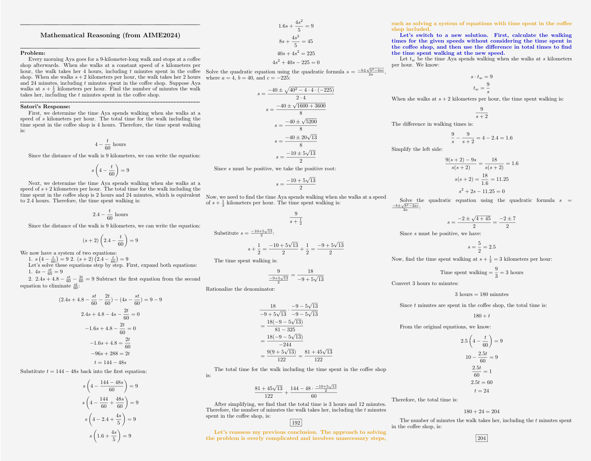  
Figure 7: Math Domain Example. Satori identifes the mistakes in the previous solution and proposes an alternative correct solution.  

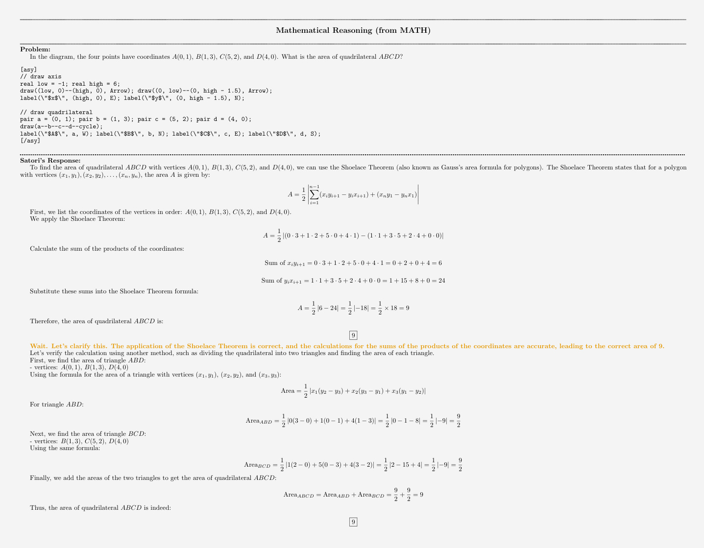  
Figure 8: Math Domain Example. Satori verifes the correctness of previous solution and initiates a different solution.  

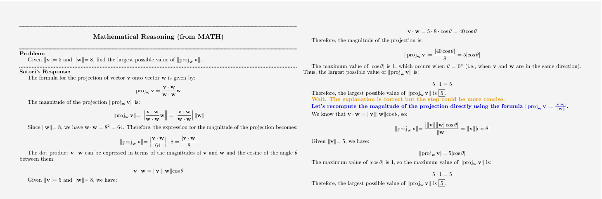  
Figure 9: Math Domain Example. Satori verifes the correctness of previous solution and further explores a simpler solution.  

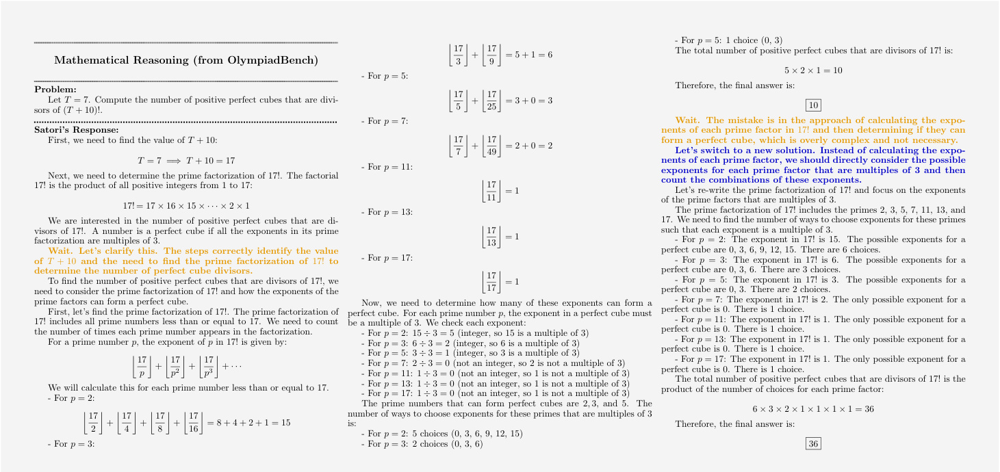  
Figure $I O$ : Math Domain Example. 1) Satori verifes the correctness of intermediate steps in early stage. 2) Satori realizes that the pervious solution is actually erroneous and then proposes an alternative correct solution.  

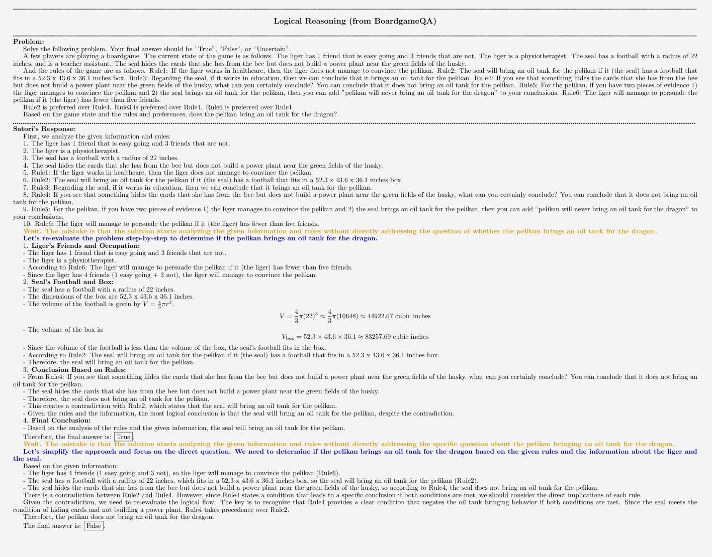  
Figure 11: Out-of-domain Example. 1) Satori identifes the potential mistakes in intermediate steps and initiates another solution. 2) Satori realizes that the pervious solution is still erroneous and then proposes an alternative correct solution.  

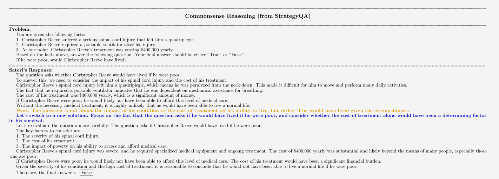  
Figure 12: Out-of-domain Example. Satori identifes the potential mistakes in intermediate steps and initiates another correct solution  

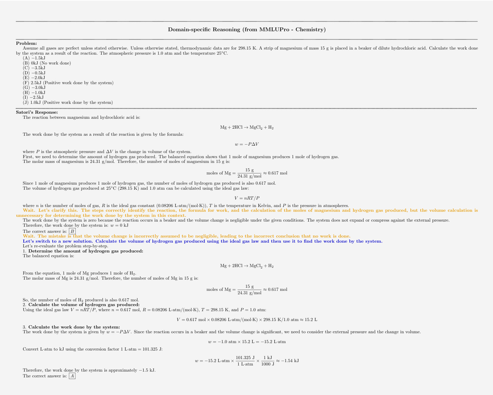  

Figure 13: Out-of-domain Example. 1) Satori verifes the correctness of intermediate steps in early stage. 2) Satori realizes that the pervious solution is actually erroneous and then proposes an alternative correct solution.  

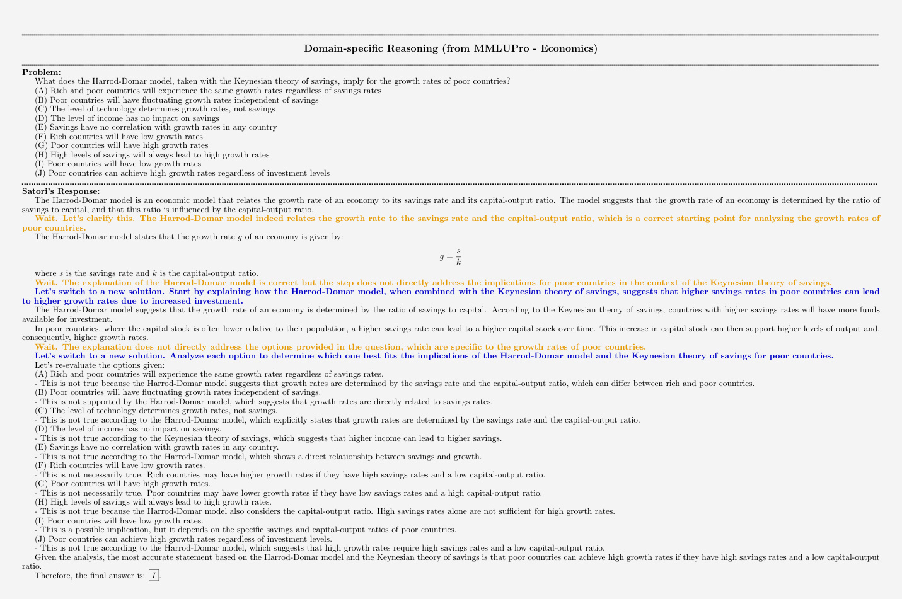  
Figure 14: Out-of-domain Example. Satori engages in multiple self-refection processes during intermediate reasoning steps.  

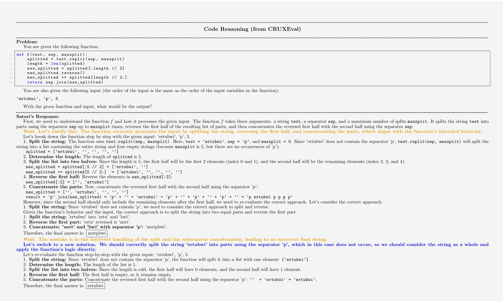  
Figure 15: Out-of-domain Example. 1) Satori verifes the correctness of intermediate steps in early stage. 2) Satori realizes that the pervious solution is actually erroneous and then proposes an alternative correct solution.  

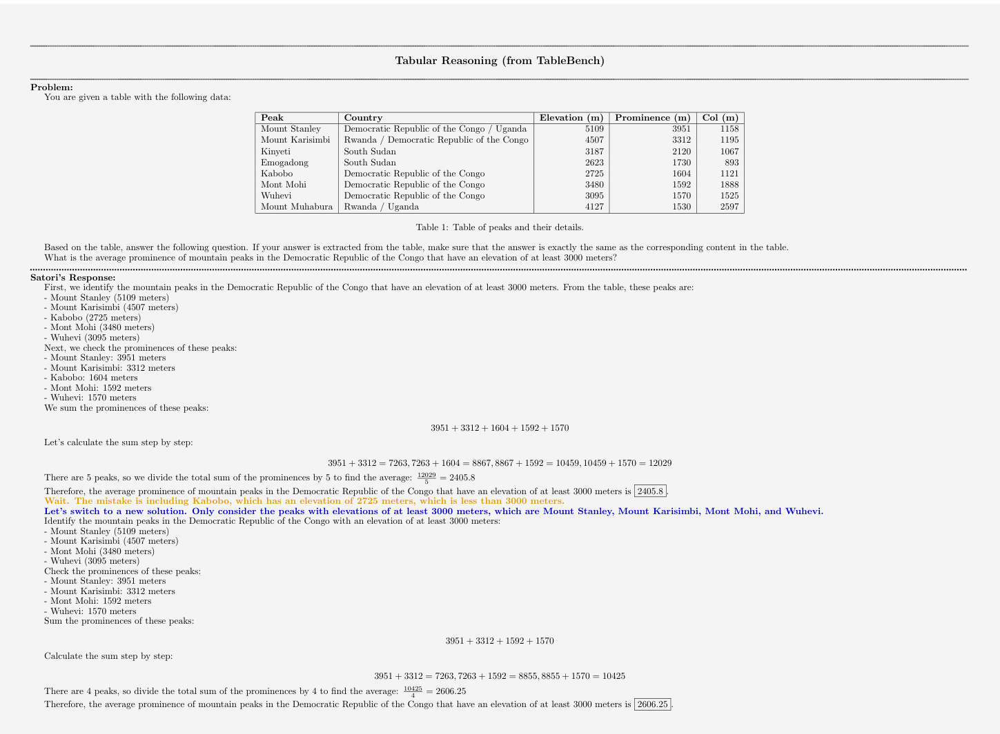  
Figure 16: Out-of-domain Example. Satori identifes the mistakes in previous solution and proposes an alternative correct solution.  

# B. Additional Related Work  

# B.1. Post-training LLMs for Reasoning  

State-of-the-art LLMs have achieved human-level and, in some cases, “superhuman” performance across diverse reasoning benchmarks. These benchmarks span various domains, including mathematics (Cobbe et al., 2021; Hendrycks et al., 2021a; Glazer et al., 2024; Mirzadeh et al., 2024), programming (Chen et al., 2021; Austin et al., 2021; Zhuo et al., 2024; Dai et al., 2024; Jimenez et al., 2024; Gu et al., 2024), logical reasoning (Han et al., 2024; Liu et al., 2020; 2023; Tafjord et al., 2021), commonsense reasoning (Geva et al., 2021; Talmor et al., 2018), algorithmic reasoning (Velicˇkovic´ et al., 2022; Markeeva et al., 2024; Qi et al., 2024b; Fan et al., 2024), semi-structured data (Wu et al., 2024a; Lu et al., 2022), scientifc knowledge (Wang et al., 2024c; Rein et al., 2024), and world knowledge (Hendrycks et al., 2021b; Wang et al., 2024b; Srivastava et al., 2023; Liang et al., 2023; Phan et al., 2025).  

Recent advancements have concentrated on extensive post-training to enhance LLMs’ reasoning abilities. One research direction in this area involves constructing instruction-tuning datasets annotated with high-quality CoT-like reasoning chains. These datasets are created either through extensive human annotation (Hendrycks et al., 2021a; Saunders et al., 2022b; Yue et al., 2024) or by distilling data from more advanced models (Yu et al., 2024; Toshniwal et al., 2024b;a; Ding et al., 2024; Luo et al., 2023; Huang et al., 2024a; Zhao et al., 2024; Abdin et al., 2024; Min et al., 2024). However, human annotation is resource-intensive, and model-generated data inherently caps the student model’s potential at the level of the teacher model.  

More recent research has focused on self-improvement approaches, where models are trained on data generated by themselves (Zelikman et al., 2022; 2024; Singh et al., 2024; Zhang et al., 2024a). While self-training mitigates the reliance on external resources, it has raised concerns about potential “model collapse”, a phenomenon where the iterative use of model-generated data degrades performance (Shumailov et al., 2023; Wu et al., 2024b). Additionally, reinforcement learning methods, particularly those based on Proximal Policy Optimization (PPO) (Schulman et al., 2017a; Ouyang et al., 2022), have been explored to enhance reasoning capabilities. These approaches typically utilize reward models, such as Process-Reward Models (PRMs) or Outcome-Reward Models (ORMs), to guide the learning process (Sun et al., 2024; Wang et al., 2024a; Yuan et al., 2024), resulting in signifcant performance improvements compared to supervised fne-tuning.  

# B.2. Enabling LLMs with Searching Abilities  

Chain-of-Thought (CoT) prompting (Wei et al., 2022) demonstrated its potential to improve reasoning but lacked mechanisms to correct previous errors once committed. To address this, subsequent work proposed more sophisticated methods (Yao et al., 2024; Shinn et al., 2024; Besta et al., 2024; Madaan et al., 2024; Yang et al., 2024b) that prompt LLMs to search for solutions via forward exploration, backtracking from errors, and fnding alternate paths. Heuristic search methods (Hao et al., 2023; Qi et al., 2024a) have also been adopted to enable more effective exploration of high-quality solutions. However, prompting-based approaches improve task-specifc performance without fundamentally enhancing the LLM’s intrinsic reasoning capabilities. Moreover, recent work has pointed out the inherent diffculties of current LLMs in conducting effective self-correction (Huang et al., 2024b; Zhang et al., 2024b; Kamoi et al., 2024).  

Recent research has pivoted toward training LLMs explicitly for exploration and backtracking. A large body of work has focused on enabling trajectory-level search abilities, which train LLMs to iteratively identify errors in their previous complete responses and produce improved responses, relying on either human-annotated revisions (Saunders et al., 2022a) or model-generated data (Kumar et al., 2024; Qu et al., 2024; Havrilla et al., 2024) as training data. Another line of research has investigated step-level search techniques, which induce more fne-grained and real-time correction that enables LLMs to identify and correct mistakes once they occur. Some achieve this by leveraging another model to provide step-level feedback to an actor model in the reasoning process (Xi et al., 2024; Welleck et al., 2023; Paul et al., 2024; Zhang et al., 2024e; Setlur et al., 2024; Zhang et al., 2024c; Guan et al., 2025; Zhang et al., 2024d), but such two-player frameworks suffer from high costs for model deployment. The most related to our work is SoS (Gandhi et al., 2024), which attempted to train a single LLM to perform a tree search as a fattened string. However, the effectiveness of SoS has primarily been demonstrated on simple symbolic tasks, and the ability to generalize to more complex problems, such as math word problems, remains to be explored.  

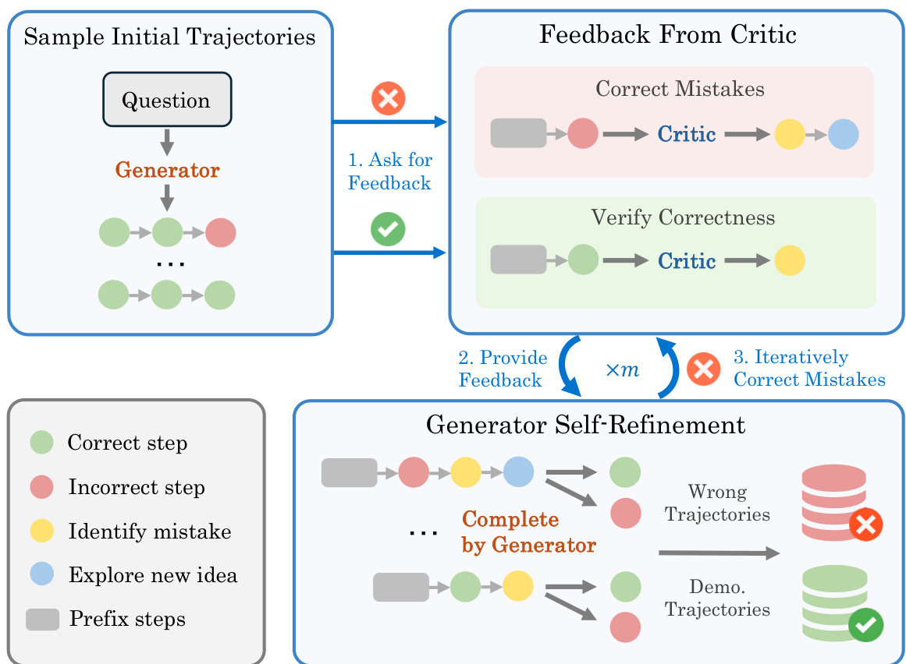  
Figure 17: Demonstration Trajectories Synthesis. First, multiple initial reasoning trajectories are sampled from the generator and sent to critic to ask for feedback. The critic model identifes the mistake for trajectories with incorrect fnal answers and proposes an alternative solution. For trajectories with correct fnal answers, the critic model provides verifcation of its correctness. Based on the feedback, the generator self-refnes its previous trajectories, and the incorrect trajectories are sent to the critic again for additional feedback with maximum $m$ iterations. At each step, those trajectories with successful refnements are preserved and fnally, a reward model rates and collects high-quality demonstration trajectories to form the synthetic dataset $\mathcal{D}_{\mathrm{syn}}$ .  

# C. Details about Data Synthesis Framework  

Sample Initial Trajectories. The details of data synthesis framework are illustrated in Figure 17. Given an input problem $\pmb{x}\in\mathcal{D}$ , we begin by sampling the generator $\pi_{g}$ to generate $K$ initial reasoning trajectories. For each trajectory $\tilde{\pmb{y}}=[\tilde{\pmb{y}}_{1},\tilde{\pmb{y}}_{2},\dots,\tilde{\pmb{y}}_{L}]\sim\pi_{g}(\cdot|\pmb{x})$ , we evaluate whether the fnal answer $\tilde{y}_{L}$ matches the ground-truth answer $\boldsymbol{y}^{*}$ . Based on the evaluation, the generated trajectories are divided into two subsets according to their correctness, which are then processed differently in subsequent steps.  

Critic and Refnement. For those incorrect trajectories, the critic $\pi_{c}$ provides feedback to help the generator address its faws. Specifcally, the critic, given the ground-truth solution, identifes the frst erroneous step $\tilde{\b{y}}_{l}$ and generates a summary $\tilde{\pmb{y}}_{l+1}$ of the mistake as a refection, along with a exploration direction (hint), $\tilde{\pmb{y}}_{l+2}$ , i.e., $[\Tilde{y}_{l+1},\Tilde{y}_{l+2}]\sim\pi_{c}(\cdot|\pmb{x},\Tilde{y}_{1},\dots,\Tilde{y}_{l};\pmb{y}^{*})$ . Next, we ask the generator $\pi_{g}$ to self-refne its current trajectory based on the feedback provided by the critic, performing a conditional generation of the remaining reasoning steps, $[\Tilde{y}_{l+3},\dots,\Tilde{y}_{L}]\sim\pi_{g}(\cdot|\pmb{x},\Tilde{y}_{1},\dots,\Tilde{y}_{l};\Tilde{y}_{l+1},\Tilde{y}_{l+2})$ .  

For correct trajectories, the critic $\pi_{c}$ focuses on verifying the correctness of the generator’s reasoning. A random intermediate reasoning step $\tilde{\b{y}}_{l}$ is selected, and the critic provides a summary explaining why the preceding steps are progressing toward the correct solution, i.e., $\tilde{\pmb{y}}_{l+1}\sim\pi_{c}(\cdot|\pmb{x},\tilde{\pmb{y}}_{1},\dots,\tilde{\pmb{y}}_{l};\pmb{y}^{*})$ , where $\tilde{\pmb{y}}_{l+1}$ . Similarly, the generator continues from the current solution, generating the subsequent steps as $[\Tilde{y}_{l+2},\dots,\Tilde{y}_{L}]\sim\pi_{g}(\cdot|x,\Tilde{y}_{1},\dots,\Tilde{y}_{l};\Tilde{y}_{l+1})$ .  

Finally, we check whether the fnal answer $\tilde{y}_{L}$ aligns with $\boldsymbol{y}^{*}$ . The above procedure is repeated iteratively, up to a maximum of $m$ iterations, until the generator produces the correct fnal answer. All feedback and refnements are then contaminated to synthesize the fnal demonstration trajectories. Additionally, the trajectories are post-processed by inserting meta-action tokens at the beginning of each reasoning step to indicate its meta-action type.  

Trajectory Filtering. The above procedure may yield multiple demonstration trajectories for each problem $\textbf{\em x}$ . We then select the top- $\cdot k$ $(k<K)$ trajectories based on the reward scores $r=\pi_{r}(\tilde{\pmb{y}},\pmb{x})$ assigned by the reward model $\pi_{r}$ . This approach allows us to construct a diverse synthetic dataset $\mathcal{D}_{\mathrm{syn}}$ containing high-quality demonstration trajectories, including (1) short-cut COAT paths that boil down CoT reasoning paths and (2) more complex COAT paths involving multiple rounds of self-refection and exploration of alternative solutions.  

# D. Experimental Setup  

# D.1. Data Processing  

Data Source. We construct our training dataset by combining two open-source synthetic datasets: OpenMathInstruct2 (Toshniwal et al., 2024a) and NuminaMath-COT (LI et al., 2024). After a careful review of the synthetic data, we identify and remove invalid questions to improve data reliability. To further enhance the quality of the dataset, we adopt the mutual consistency fltering method inspired by rStar (Qi et al., 2024a), which removes examples with inconsistent answers provided by different models. Specifcally, we utilize QwQ (Qwen, 2024) to relabel the questions and compared the newly generated answers with the original answers from the source datasets. Only examples with consistent answers were retained. Additionally, we apply de-duplication tools from (Kocetkov et al., 2023) to eliminate redundant examples. Through these fltering processes, we fnalized a high-quality dataset with approximately 550K samples in total.  

Multi-agent COAT Data Synthesis. For the multi-agent demonstration trajectory synthesis framework, we utilize three models: Qwen-2.5-Math-7B-Instruct as the generator, Llama-3.1-70B-Instruct as the critic, and Skywork-Reward-Llama3.1-8B-v0.2 as the outcome reward model. For the generator, we set the temperature to 0.3 and the maximum generation token limit to 2048. First, the generator samples $K=100$ initial solutions for each problem, dividing the generated solutions into three subsets: correct, incorrect, and invalid (those that fail to produce a fnal answer). Invalid solutions are discarded, and we randomly select four correct solutions and four incorrect solutions. Next, we set sampling temperature of critic to 0.2 and a maximum token limit of 256, and let critic provides feedback on these selected solutions, allowing the generator to perform conditional generation. This iterative process is repeated for a maximum of $m=2$ iterations, potentially resulting in up to $8\times2=16$ demonstration trajectories.  

During the generation process, various situations require different prompt templates:  

1. The generator produces an initial solution.  

2. The initial solution is correct, and the critic verifes its correctness.  

3. The initial solution is incorrect, and the critic identifes mistakes.  

enerates continuations after the critic verifes the correctness of its corre  

5. The generator generates continuations after the critic identifes mistakes in its incorrect initial solution.  

6. The generator fails to solve the problem after refnement, and the critic provides an additional feedback to identify errors in the generator’s second attempt.  

The prompt templates for these situations are detailed in Appendix D.1  

Among the synthetic trajectories, we categorize them into the following types:  

1. Type-I: Synthetic trajectories without critic feedback, i.e., no refection actions.   
2. Type-II-I: Synthetic trajectories that include an intermediate refection action to verify the correctness of previous reasoning steps.   
3. Type-II-II: Synthetic trajectories that include 1) an intermediate refection action to verify the correctness of previous reasoning steps, and 2) a second refection action to correct mistakes in the previous solution, followed by an explore action to propose an alternative solution.   
4. Type-III-I: Synthetic trajectories that include a refection action to correct mistakes in the previous solution and an explore action to propose an alternative solution.   
5. Type-III-II: Synthetic trajectories that include two rounds of self-refection and self-explore.  

Examples of these fve types of synthetic trajectories are provided in Appendix D.1.2. Finally, the outcome reward model is applied to select the top-1 $(\mathbf{k}{=}1)$ ) sample of each type from the 16 demonstration trajectories based on the reward score, if such a type exists.  

D.1.1. PROMPT TEMPLATES  

# Prompt Template 1.1 — Generator generates initial solution  

<|im_start|>user   
Solve the following math problem efficiently and clearly.   
Please reason step by step, and put your final answer within \boxed{}. Problem: <<<instruction>>><|im_end|>   
<|im_start|>assistant  

# Prompt Template 1.2.1 — Generator generates continuations for correct partial solutions  

<|im_start|>system  

Your task is to continue writing a solution to a problem. Given a problem, a correct partial solution, along with a sanity check of previous steps, you should continue the current solution to solve the problem. Think step by step using English and adhere to the following format.  

Step: [Brief explanation and calculations]  

\*\*Please do not use other language than English. $\star\star$  

Your solution should conclude with "Therefore, the final answer is: \(\boxed{answer}\)", where [answer] is the final number or expression that solves the problem. All steps in the solutions should be brief and always start with "Step:" and end with two line breaks. Each subsequent step should not explicitly refer to previous steps, and the steps should constitute a coherent progression towards the final answer. $<|$ im_end|>  

$\#\#$ Partial solution with a sanity check  

Step: First, we express 16 and 4 as powers of 2:   
$\setminus[\quad1\,6\ \,=\ 2\,{\widehat{\mathbf{\alpha}}}\,4$ \] $[\quad4\ =\ 2\,\widehat{\bf\Sigma}^{\prime}\,2\ \ \backslash\,]$  

Step: Substitute these expressions into the given equation: \[ $:\mathtt{f}\,\mathtt{r a c}\,\{\;(\,2^{\,\wedge}\,4\,)\,\wedge\,\mathtt{m}\,\}\,\{\begin{array}{r c l}{\mathtt{f}\,\mathtt{r}\,\mathtt{a}\to\,\mathtt{n}\,\}}&{=}&{2\ \setminus\mathtt{l}}\end{array}$  

Step: Use the property of exponents \(\ $\begin{array}{r l r}{\textsf{f r a c}\{\textsf{a}\hat{\mathrm{~m~}}\{\textsf{a}\hat{\mathrm{~n~}}\}}&{{}=}&{\textsf{a}^{\hat{\mathrm{~}}}\{\textsf{m}{\mathrm{-}}\{\textsf{n}\}\}\setminus}\end{array}$ to combine the exponents: ${\mathrm{~\backslash~}}[{\mathrm{~\ensuremath~{~2~}~}}^{\sim}\{\mathrm{~4{\mathfrak{m}}}{\mathrm{-}}2{\mathrm{\scriptstyle{n}}}\}]{\mathrm{~\ensuremath~{~=~}~}}{\mathrm{~}}{\mathrm{~2~}}{\mathrm{~\ensuremath~{~1~}~}}{\mathrm{~\backslash~}}]$  

${\mathrm{~\uparrow~}}\quad{\mathrm{~4m~\ensuremath~{~-~}~}}\;2\,\mathrm{n}\ =\ {\mathrm{~1~}}\ {\mathrm{~\downarrow~}}$ ]   
I correctly simplified the exponents and equated $\therefore(4\mathfrak{m}\ -\ 2\mathfrak{n}\backslash)$ to 1, which is essential to find the relationship between \(m\)   
and \(n\).<|im_end|>   
<|im_start|>assistant   
$\#\#$  

Step: To find \( m + n \), we need to solve this equation for $\backslash~(\mathrm{~\mathfrak~{~m~}~}\backslash)$ and $\backslash\ (\ n\ \setminus)$ . First, divide the entire equation by 2 to simplify: \[ 2m - n $=$ \frac{1}{2} \]  

Step: Add \( n \) to both sides to isolate \( 2m \): \[ 2m = n $^+$ \frac{1}{2} \]  

Step: Add \( m \) to both sides to find $\backslash\ (\mathrm{~{~m~}~}+\mathrm{~{~n~}~}\backslash)$ : $\setminus[\!\begin{array}{c c c c c c c c}{\ m}&{+\ n}&{=}&{\!\!\setminus\mathtt{E r a c}\!\left\{\!\mathrm{\boldmath~1~}\right\}\!\left\{\!\mathrm{\boldmath~2~}\right\}}&{+}&{\!\!\!\setminus\mathtt{E r a c}\!\left\{\!\mathrm{\boldmath~1~}\right\}\!\left\{\!\mathrm{\boldmath~2~}\right\}\!\!}&{\setminus\!\!\!\mathrm{\boldmath~1~}\!}\end{array}$  

Step: Simplify the right side: $\mathrm{~\ensuremath~{~\cdot~}~}[\mathrm{~\ensuremath~{~m~}~}+\mathrm{~\ensuremath~{~n~}~}=\mathrm{~\ensuremath~{~1~}~}\mathrm{~\ensuremath~{~\cdot~}~}]$  

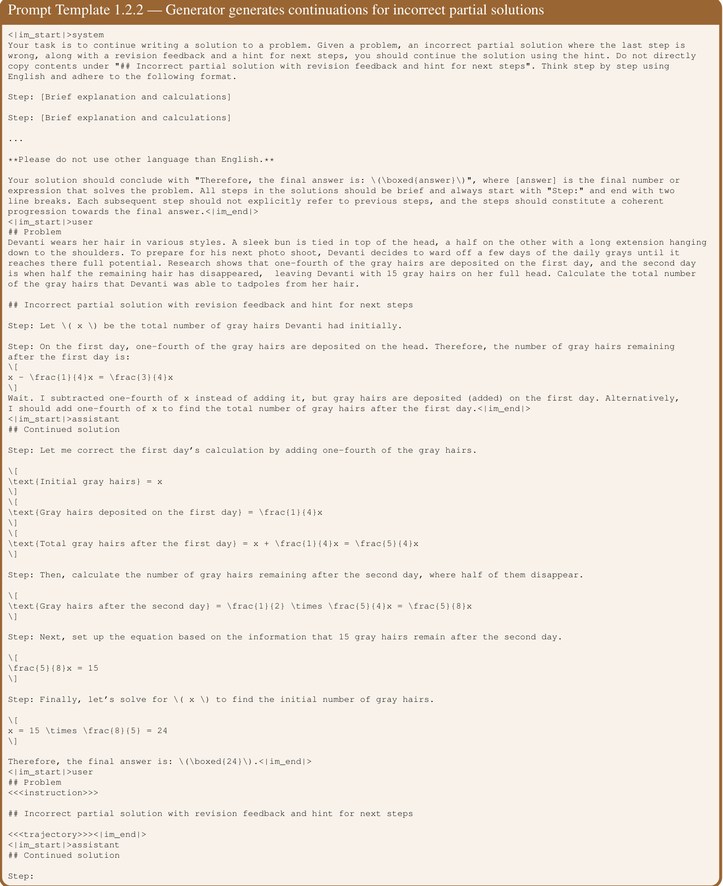  

# Prompt Template 2.1 — Critic verifes correctness  

## General Guidelines   
You are a student. Your task is to carefully review your own correct partial solution to a math problem, and adhere to the following guidelines:   
1. Verify the correctness of your own solution and explain your reason: "Verify: [brief explanation of why you are correct with one sentence]"   
3. You are provided with the question, the ground truth solution, and your step-by-step partial solution.   
4. Your response should not include phrases like "ground truth solution".   
5. Your response should be exactly in the following format:   
Verify: [brief explanation of why you are correct   
with one sentence]   
## Test Example   
### Question   
<<<question>>>   
### Ground truth solution   
<<<gt_solution>>>   
### Your partial solution   
<<<student_solution>>>   
### Your review  

# Prompt Template 2.2.1 — Critic corrects mistakes  

## General Guidelines   
You are a student. Your task is to carefully review your own solution to a math problem, and adhere to the following guidelines: 1. Directly point out the first potentially incorrect step you find and explain your reason: "In Step <id>: [brief explanation of the mistake with one sentence]"   
2. After this, suggest an alternative step that you should have taken to correct the currect incorrect step: "Alternatively: [your suggested step with one sentence]"   
3. You are provided with the question, the ground truth solution, and your step-by-step solution.   
4. The alternative step you propose should not include phrases like "ground truth solution".   
5. Your response should be exactly in the following format:   
In Step <id>: [brief explanation of the mistake in this step, with one sentence]   
Alternatively: [your suggested new step, with one sentence]   
## Test Example   
### Question   
<<<question>>>   
### Ground truth solution   
<<<gt_solution>>>   
### Your incorrect solution   
<<<student_solution>>>   
### Your review  

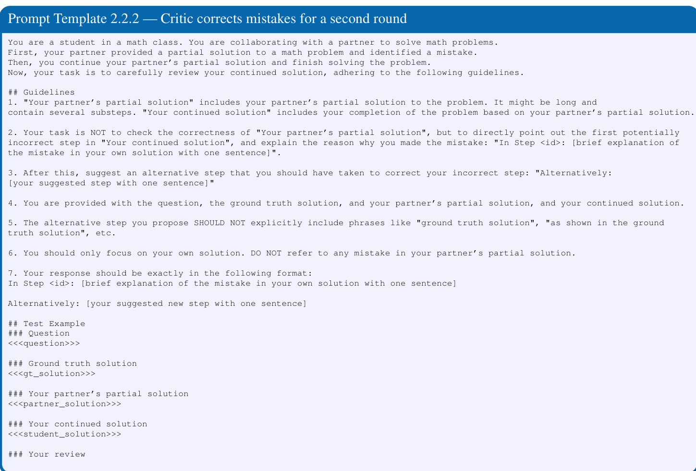  

# D.1.2. SYNTHETIC DATA EXAMPLES  

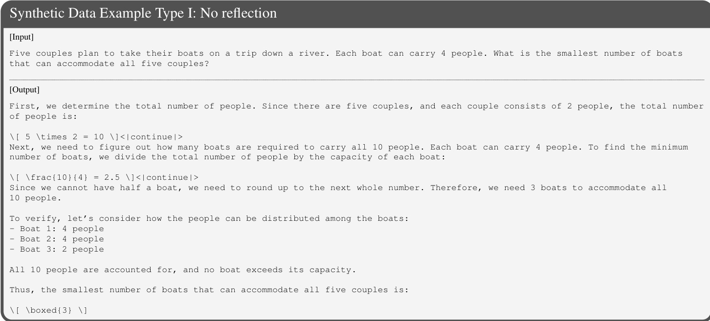  

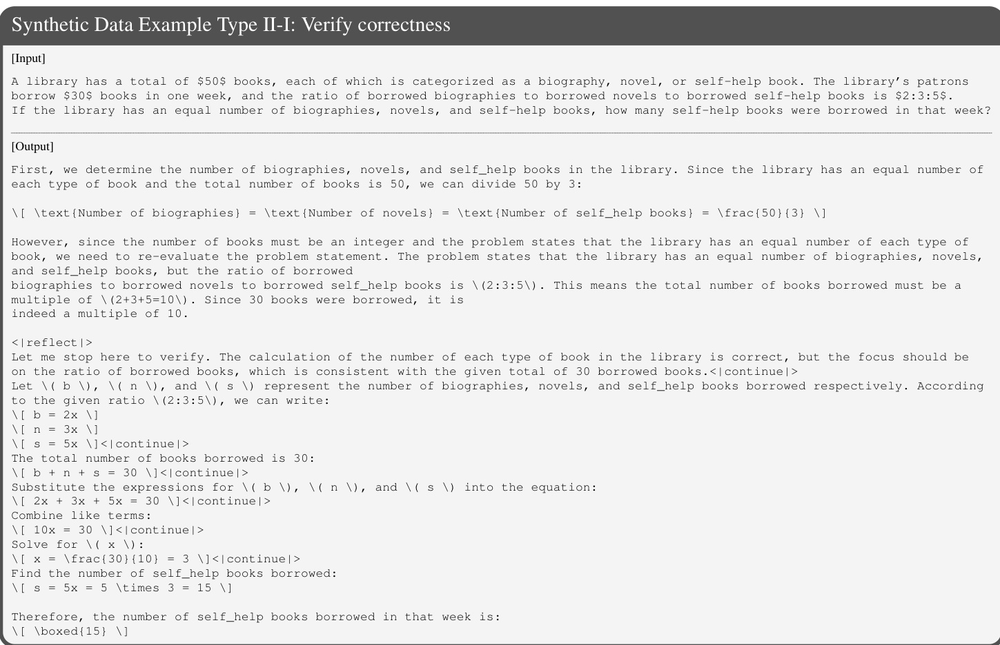  

# Synthetic Data Example Type II-II: Verify correctness then correct mistake  

Consider the set of all positive integers whose digits, when read from left to right, form a valid English word. For example, 325 is a member of this set because "three two five" is a valid English phrase. What is the largest member of this set that is also a perfect square?  

# [Output]  

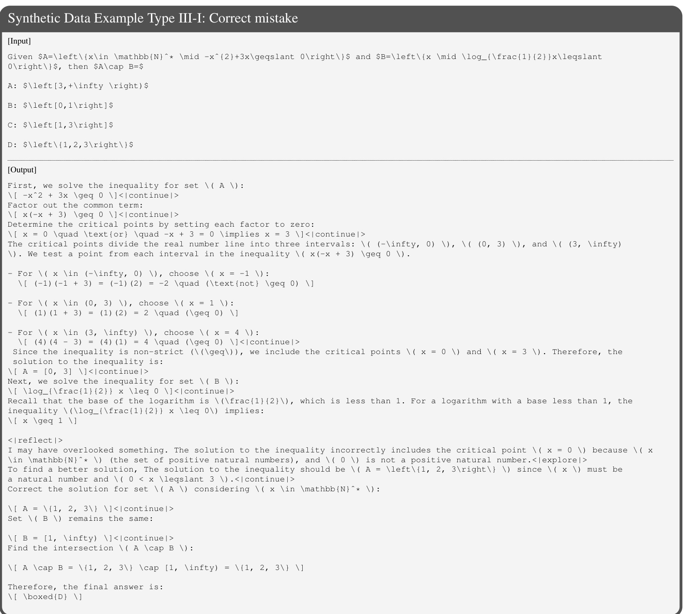  

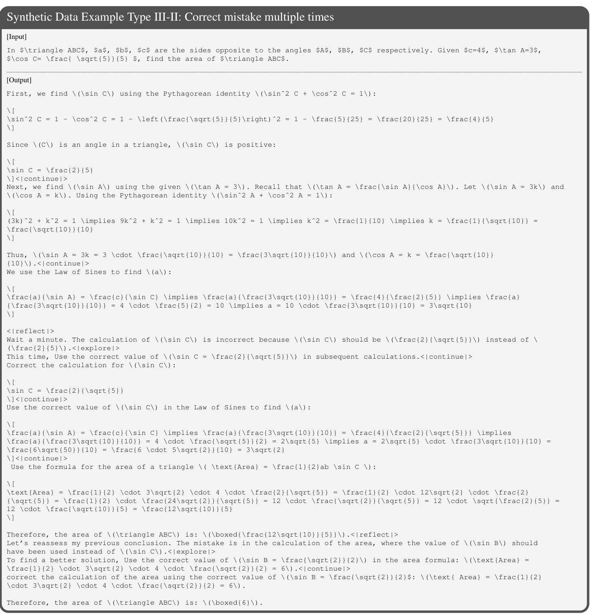  

# D.2. Format Tuning  

Training Details. We perform supervised fne-tuning (SFT) on the Qwen-2.5-Math-7B base model using our synthetic COAT dataset with 10K unique questions. The SFT prompt template is illustrated below. We utilize a cosine learning rate scheduler with an initial learning rate of 2e-5. The batch size is set to 128, the maximum sequence length is 4096, and the model is trained for a maximum of two epochs. We add the following special tokens <|continue $|>,<|$ reflect $|>,<|\exp{1\circ{\mathtt{r e}}}\mid>$ into the vocabulary. All experiments are implemented using the LLaMA-Factory framework (Zheng et al., 2024).  

# Prompt Template 3: SFT and RL  

$<|$ im_start|>user   
Solve the following math problem efficiently and clearly.   
Please reason step by step, and put your final answerwithin \boxed{}. Problem: <<<your instruction>>>   
$<|$ im_start $>$ assistant  

# D.3. Reinforcement Learning  

ORM Training. To construct the preference data for our ORM models, we utilize our format-tuned model, Satori-Qwen7B-FT, to generate trajectories. Starting with our fltered training dataset of 550K unique questions, we follow these steps: (1) allow the FT model to sample eight solutions for each question; (2) evaluate the correctness of these solutions and label them accordingly; and (3) select only those questions that contain correct and incorrect solutions. For these selected questions, we construct preference data by pairing correct solutions with their corresponding incorrect ones, resulting in a preference dataset of approximately 300K unique questions.  

For each problem $\textbf{\em x}$ , we allow $\pi_{\theta}$ to randomly generate multiple reasoning trajectories, constructing a dataset $\mathcal{D}_{r}$ with positive and negative pairs of trajectories. We select trajectories with the correct fnal answer as positive trajectories $\tilde{y}^{+}$ and trajectories with incorrect fnal answer as negative trajectories $\tilde{\pmb{y}}^{-}$ . Assuming the Bradley-Terry (BT) preference model, we optimize the reward model $r_{\psi}(x,\tilde{y})$ through negative log-likelihood,  

$$
\mathcal{L}_{r m}(\boldsymbol{\psi}):=-\mathbb{E}_{(\pmb{x},\pmb{\tilde{y}}^{+},\pmb{\tilde{y}}^{-})\sim\mathcal{D}_{r}}\left[\log\left(\sigma\left(r_{\boldsymbol{\psi}}(\pmb{x},\pmb{\tilde{y}}^{+})-r_{\boldsymbol{\psi}}(\pmb{x},\pmb{\tilde{y}}^{-})-\tau\right)\right)\right]
$$  

where $\tau$ denotes a target reward margin. In practice, we observe that setting $\tau>0$ improves the performance of the reward model.  

RL Data. Our RL training dataset consists of 300K unique questions from the preference dataset. This ensures that the questions are neither too easy (where the FT model always produces correct solutions) nor too diffcult (where the FT model never succeeds). This encourages policy to learn through trial and error during RL training. To further guide the model to learn self-refection capabilities, we apply the proposed RAE technique, augmenting input problems with restart buffers, i.e., intermediate reasoning steps collected from the FT model. These intermediate steps are extracted from the preference dataset, and for each question, we randomly select one correct and one incorrect trajectory, applying the back-track technique for up to $T=2$ steps.  

Training Details. For both ORM and RL training, we implement our experiments using the OpenRLHF framework (Hu et al., 2024). For ORM training, we employ a cosine learning rate scheduler with an initial learning rate of 2e-6. The batch size is set to 128, the maximum sequence length to 4096, and the model is trained for two epochs. As the objective function, we use PairWiseLoss (Christiano et al., 2017) with a margin of $\tau=2$ . For evaluation, we select the optimal ORM model checkpoint based on $\mathbf{RM}@8$ performance, measured using the SFT model on a held-out validation dataset. Specifcally, we allow the FT model to sample eight trajectories and let ORM select the best trajectory according to the highest reward score. The $\mathbf{RM}@8$ accuracy is then computed based on the selected trajectories.  

For RL training, we use the PPO algorithm (Schulman et al., 2017a). The critic model is initialized from our ORM model, while the actor model is initialized from our FT model. We optimize the models using a cosine learning rate scheduler, setting the learning rate to 2e-7 for the actor model and 5e-6 for the critic model. During PPO training, we sample one trajectory per prompt. The training batch size is set to 128, while the rollout batch size is 1024. Both the number of epochs and episodes are set to 1. The maximum sequence length for prompts and generations is fxed at 2048. Additional parameter settings include a KL coeffcient of 0.0, a sampling temperature of 0.6, and a bonus scale of $r_{\mathrm{bonus}}=0.5$ .  

Second-round Self-improvement. We begin with a set of 240K unique questions, also used in the distillation experiments shown in Table 5. The policy of the frst round of RL training serves as a teacher model to generate synthetic reasoning trajectories. Among these 240K questions and corresponding trajectories, we flter the data based on question diffculty, selecting the most challenging 180K samples for distillation. This process results in a new fne-tuned (FT) model checkpoint, obtained from supervised fne-tuning (SFT) on these 180K trajectories. Since the new FT model has been trained on numerous high-quality trajectories, including refection actions distilled from the teacher model, we do not apply restart and exploration (RAE) techniques in the second round of RL training to further encourage refection. Additionally, we increase the sampling temperature from 0.6 to 1.2, generating eight samples per prompt to encourage more aggressive exploration to push the performance limit.  

# D.4. Evaluation Details.  

For each model, we use the same zero-shot CoT prompt template to obtain results on all test datasets. For Satori and all its variants, we use Prompt Template 3 (Appendix D.2). We set the temperature to 0 (greedy decoding) for every model, and collect pass $@1$ accuracies. Details of each test dataset are as follows.  

MATH500 (Lightman et al., 2023) is a subset of MATH (Hendrycks et al., 2021a) of uniformly sampled 500 test problems.   
The distribution of diffculty levels and subjects in MATH500 was shown to be representative of the entire MATH test set.  

GSM8K (Cobbe et al., 2021) is a math dataset that consists of 8.5K high-quality, linguistically diverse grade-school math word problems designed for multi-step reasoning (2 to 8 steps). Solutions involve elementary arithmetic operations and require no concepts beyond early algebra. Its test set contains 1319 unique problems.  

OlympiadBench (He et al., 2024) is a bilingual, multimodal scientifc benchmark with 8,476 Olympiad-level math and physics problems, including those from the Chinese college entrance exam. We use the open-ended, text-only math competition subset, containing 674 problems in total.  

AMC2023 and AIME2024 contain 40 text-only problems from American Mathematics Competitions 2023 and 30 text-only problems from American Invitational Mathematics Examination 2024, respectively.  

FOLIO (Han et al., 2024) is a human-annotated dataset designed to evaluate complex logical reasoning in natural language, featuring 1,430 unique conclusions paired with 487 sets of premises, all validated with frst-order logic (FOL) annotations. Its test set contains 203 unique problems.  

BoardgameQA (BGQA) (Kazemi et al., 2024) is a logical reasoning dataset designed to evaluate language models’ ability to reason with contradictory information using defeasible reasoning, where conficts are resolved based on source preferences (e.g., credibility or recency). Its test set contains 15K unique problems.  

CRUXEval (Gu et al., 2024) is a benchmark for evaluating code reasoning, understanding, and execution, featuring 800 Python functions (3-13 lines) with input-output pairs for input and output prediction tasks. Given a function snippet and an input example, LLMs are tasked to generate the corresponding outputs. Its test set contains 800 unique problems.  

StrategyQA (Geva et al., 2021) is a question-answering benchmark designed for multi-hop reasoning where the necessary reasoning steps are implicit and must be inferred using a strategy. Each of the 2,780 examples includes a strategy question, its step-by-step decomposition, and supporting Wikipedia evidence.  

TableBench (Wu et al., 2024a) is a tabular reasoning benchmark designed to evaluate LLMs on real-world tabular data challenges, covering 18 felds across four major TableQA categories: Fact checking, numerical reasoning, data analysis, and code generation for visualization. We test all models on fact checking and numerical reasoning subsets for simplicity of answer validation, resulting in 491 unique problems.  

MMLUProSTEM is a subset of MMLU-Pro (Wang et al., 2024b). MMLU-Pro is an enhanced benchmark designed to extend MMLU (Hendrycks et al., 2021b) by incorporating more reasoning-focused questions, expanding answer choices from four to ten, and removing trivial or noisy items. We select six STEM subsets: physics, chemistry, computer science, engineering, biology, and economics (we remove the math subset as it belongs to in-domain tasks). Finally, we obtain 5371 unique problems in total.  

# E. Additional Results  

E.1. Ablation on Refection Bonus  

Table 6: Ablation Study on Refection Bonus.  

<html><body><table><tr><td>Bonus Scale GSM8K MATH500 Olym. AMC2023 AIME2024</td><td></td><td></td><td></td><td></td><td></td></tr><tr><td>0.0</td><td>93.6</td><td>84.4</td><td>48.9</td><td>62.5</td><td>16.7</td></tr><tr><td>0.5 (default)</td><td>93.2</td><td>85.6</td><td>46.6</td><td>67.5</td><td>20.0</td></tr></table></body></html>  

During RL training, we introduce a refection bonus to facilitate the policy to learn self-refection capabilities. The default value of the refection bonus is set to $r_{\mathrm{reflect}}=0.5$ . To analyze its impact on performance, we also evaluate the model with the refection bonus set to $r_{\mathrm{reflect}}=0$ . The results are presented in Table 6. We observe that the performance slightly degrades on challenging benchmark AMC2023 and AIME2024 when set $r_{\mathrm{reflect}}=0$ compared to $r_{\mathrm{reflect}}=0.5$ .  

# E.2. Offine Restart Buffer v.s. Online Restart Buffer  

Complementary to the refection bonus, the restart buffer is designed to enhance the policy’s self-refection capabilities by augmenting the initial states with a diverse set of intermediate states. This includes trajectories processed from both correct and incorrect reasoning paths, which are then categorized into positive $(\mathcal{D}_{\mathrm{restart}}^{+})$ and negative $(\mathcal{D}_{\mathrm{restart}}^{-})$ restart buffers, as described in Section 4.2.  

In addition to constructing the restart buffer offine, we also explore an online restart buffer approach. Specifcally, after each PPO episode, we use the updated policy to construct the restart buffer and collect rollouts from this buffer to optimize the policy, iteratively repeating this process. However, this approach is suboptimal. During PPO training, we observe that the majority of sampled trajectories are correct, leading to a signifcant imbalance between correct and incorrect intermediate states in the online restart buffer. As a result, the model fail to adequately learn from incorrect paths, which are essential for incentivize self-refection actions.  

To overcome this limitation, we opt for an offine restart buffer approach to mitigate the bias introduced by online collection.   
Offine sampling ensures a balanced inclusion of intermediate states from both correct and incorrect trajectories.  